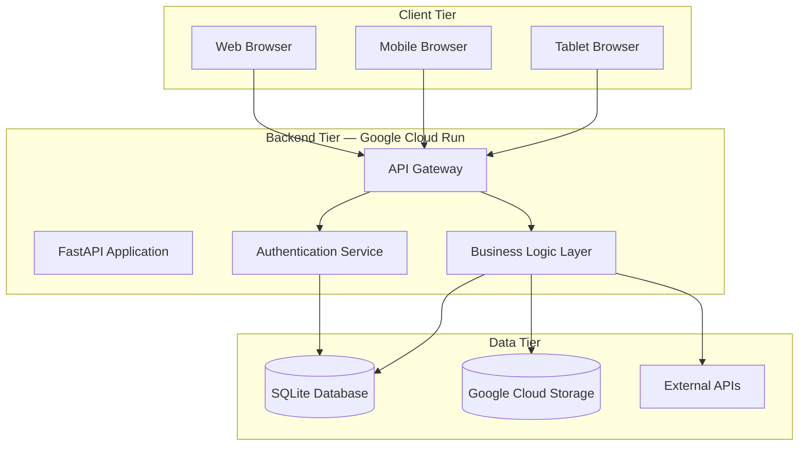
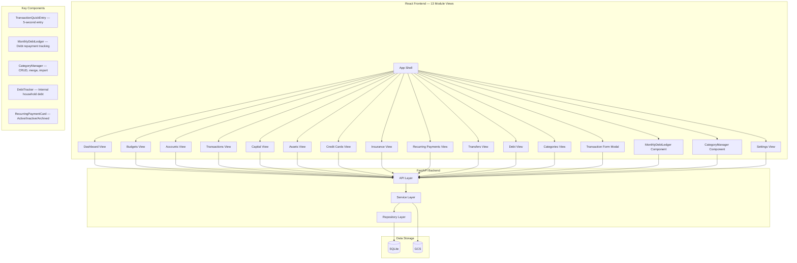
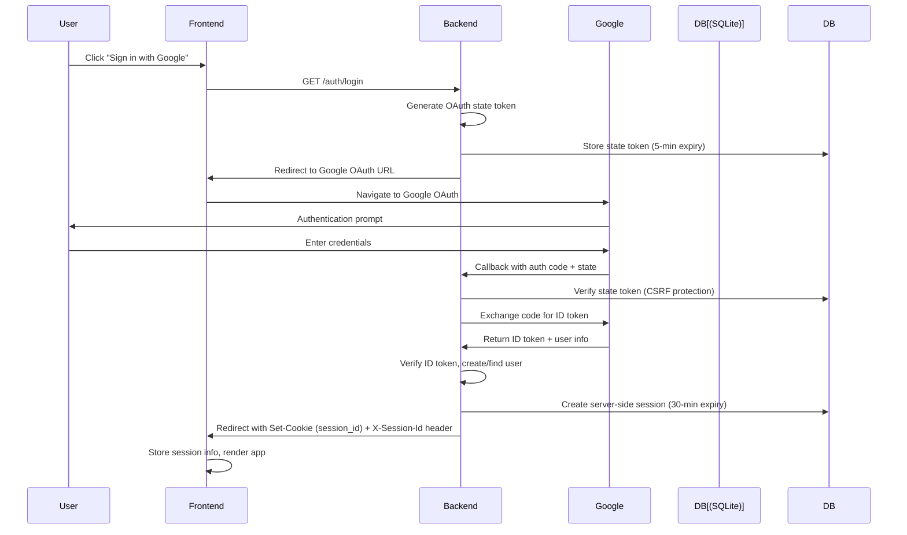
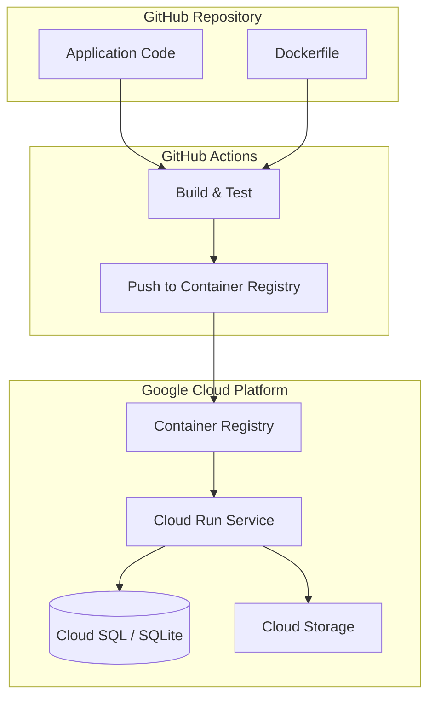

# Architecture Decision Document — Financial Tracker

_This document builds collaboratively through step-by-step discovery. Sections are appended as we work through each architectural decision together._

---

## Step 1: Project Context Analysis

### Project Context Summary

Based on the project context file, the following AI development rules apply:

**Core Principles:**
- Code is generated in small, verifiable increments
- Each feature must pass tests before moving to the next
- Documentation is kept up to date with code changes
- Errors are treated as system problems, not user problems

**Development Approach:**
- Context-first development — understand before implementing
- Test-driven where feasible, but pragmatic when time-constrained
- Minimal viable implementation — avoid over-engineering
- Clear error messages and user feedback

**File Organization:**
- Source code organized by feature/module
- Tests co-located with source where practical
- Configuration externalized from code
- Assets organized by type

### Input Documents Loaded

**1. Product Requirements Document (PRD)** — Updated 2026-05-24
- 47 user stories with 66 acceptance criteria (AC-001 through AC-066)
- 13 modules: Dashboard, Budgets, Accounts, Capital, Assets, Credit Cards, Insurance, Recurring Payments, Transactions, Transfers, Debt, Categories (MVP), Budgets/Capital/Transfers (Phase 2), Credit Cards/Insurance/Debt (Phase 3)
- 40+ API endpoints defined (including Category CRUD + merge, Debt endpoints, Transaction duplicate/archive, Account balance update, Recurring trigger, Alert management, API rate limiting middleware)
- 3 user journeys: Daily Transaction Entry, Monthly Reconciliation, Annual Data Export
- External services: Google OAuth, ExchangeRate-API, Google Cloud Storage
- Section 4: Non-Functional Requirements (Performance, Security, Reliability, Scalability, Cost, Compatibility, Maintainability)

**2. UX Design Specification** — Updated 2026-05-24
- Dark futuristic aesthetic with Inter + JetBrains Mono typography
- Tailwind CSS + shadcn/ui design system
- Mobile-first responsive strategy
- 13 custom components specified (updated: CategoryManager, DebtTracker, MonthlyDebtLedger)
- Core interaction: "Enter transaction in under 5 seconds"
- 17 default category templates (12 expense + 5 income) available via on-demand "Create Default Categories" button
- All categories are household-specific — no system-wide defaults
- CSV import with category mapping and auto-create
- Debt Account flag UI in account management
- NFR considerations: session timeout (30min), PWA support, data retention, file size limits (50MB/year)

**3. Product Brief**
- Target: Small households (2-4 members)
- Platform: Web application
- Backend: Python/FastAPI, Database: SQLite
- Frontend: React with Chart.js
- Hosting: Google Cloud Run

**4. Project Context**
- AI development conventions and rules
- File organization patterns
- Testing expectations

**5. Decision Log**
- 10 architectural decisions (D001-D010)
- Key decisions: Python/FastAPI backend, SQLite database, Google OAuth, serverless hosting

### Architectural Constraints

From the PRD and decision log, the following constraints are established:

| Constraint | Value | Source |
|-----------|-------|--------|
| Backend Language | Python | PRD |
| Backend Framework | FastAPI | PRD |
| Database | SQLite with WAL mode | PRD |
| ORM | SQLAlchemy | PRD |
| Authentication | Google OAuth 2.0 | PRD |
| Hosting | Google Cloud Run | PRD |
| Frontend | React + Chart.js | PRD |
| Design System | Tailwind CSS + shadcn/ui | UX Spec |
| Concurrent Users | 2-4 | PRD |
| Data Retention | 3 years active | PRD |
| Storage | 5GB Google Cloud Storage | PRD |
| External APIs | ExchangeRate-API | PRD |

---

## Step 2: Architecture Overview

### System Architecture

The Financial Tracker follows a **serverless three-tier architecture**:



### Architecture Decision Records

| ADR | Decision | Rationale |
|-----|----------|-----------|
| ADR-001 | Python/FastAPI backend | Lightweight, API-first, excellent async support |
| ADR-002 | SQLite with WAL mode | Zero cost, handles 2-4 concurrent users, no server management |
| ADR-003 | Google Cloud Run | Serverless, auto-scaling, pay-per-use, integrates with Google OAuth |
| ADR-004 | Google OAuth 2.0 | User-friendly, no password management, integrates with Google ecosystem |
| ADR-005 | React frontend | Component-based, large ecosystem, good performance |
| ADR-006 | Tailwind CSS + shadcn/ui | Themeable, consistent design system, rapid development |
| ADR-007 | Chart.js | Lightweight, React integration, sufficient for financial visualizations |
| ADR-008 | ExchangeRate-API | Free tier available, reliable, simple integration |
| ADR-009 | Google Cloud Storage | 5GB free tier, integrates with Cloud Run, reliable CDN |
| ADR-010 | Serverless hosting | No server management, auto-scaling, cost-effective for small user base |

### Component Architecture



---

## Step 3: Technology Stack Decisions

### Backend Decisions

| Decision | Option Chosen | Alternatives Considered | Rationale |
|----------|--------------|------------------------|-----------|
| Framework | FastAPI | Flask, Django, FastAPI | FastAPI has automatic OpenAPI docs, async support, better performance than Flask, less overhead than Django |
| ORM | SQLAlchemy | Prisma, raw SQL, Peewee | SQLAlchemy is mature, well-documented, excellent async support via SQLAlchemy 2.0 |
| Task Scheduler | APScheduler | Celery, cron, custom | In-process scheduler sufficient for 2-4 users, no message broker needed |
| Validation | Pydantic | Marshmallow, custom | Built into FastAPI, type-safe, automatic serialization |
| Testing | pytest | unittest, pytest-bdd | pytest is industry standard, excellent plugin ecosystem |

### Frontend Decisions

| Decision | Option Chosen | Alternatives Considered | Rationale |
|----------|--------------|------------------------|-----------|
| Framework | React | Vue, Svelte, Angular | Largest ecosystem, best component libraries, strong job market |
| State Management | React Query | Redux, Zustand, Context API | React Query handles server state, caching, and synchronization automatically |
| Styling | Tailwind CSS + shadcn/ui | Styled Components, Material UI, Bootstrap | Tailwind provides design system consistency, shadcn/ui provides accessible components |
| Charts | Chart.js | D3.js, Recharts, Highcharts | Chart.js is lightweight, sufficient for financial charts, good React integration |
| Forms | React Hook Form | Formik, Final Form | React Hook Form has minimal re-renders, better performance |
| HTTP Client | Axios | Fetch, TanStack Query | Axios has interceptors, automatic JSON transformation, better error handling |

### Infrastructure Decisions

| Decision | Option Chosen | Alternatives Considered | Rationale |
|----------|--------------|------------------------|-----------|
| Hosting | Google Cloud Run | Vercel, Railway, AWS Lambda | Cloud Run integrates with Google OAuth, supports Docker containers, pay-per-use |
| Database | SQLite | PostgreSQL, MongoDB, Firebase | SQLite is zero-cost, sufficient for 2-4 users, no server management |
| Storage | Google Cloud Storage | AWS S3, Azure Blob | 5GB free tier, integrates with Cloud Run, reliable CDN |
| Authentication | Google OAuth | Auth0, Supabase, custom | User-friendly, no password management, integrates with Google ecosystem |
| CI/CD | GitHub Actions | GitLab CI, CircleCI | GitHub Actions is free for public repos, integrates with GitHub |

---

### Service Layer Pattern

The backend follows a **service layer pattern** to separate business logic from route handlers:

```
backend/
├── routes/           # Thin HTTP layer — request parsing, response formatting
│   ├── auth.py       # OAuth login/logout, CSRF token endpoints
│   ├── households.py # Household CRUD, member management, invitations
│   ├── categories.py # Category CRUD, tree operations, spending rollup
│   └── dashboard.py  # Dashboard data aggregation (planned)
├── services/         # Business logic layer — validation, orchestration, calculations
│   └── category_service.py  # Category validation, circular relationship checks, household membership
├── models.py         # SQLAlchemy ORM models (11 models)
├── auth.py           # OAuth flow implementation, session validation
├── database.py       # Database setup, connection pooling, default category templates
└── main.py           # FastAPI app initialization, middleware, CORS
```

**Service Layer Responsibilities:**
- **Validation**: Business rule validation (e.g., color uniqueness within household, circular relationship detection)
- **Orchestration**: Multi-step operations (e.g., archive category → reassign children → update dependent records)
- **Calculations**: Complex computations (e.g., spending rollup across category hierarchy)
- **Household Membership**: Verifying user belongs to target household before operations

**Route Handler Responsibilities:**
- Request parsing and parameter validation
- Authentication/authorization checks
- Calling appropriate service functions
- Formatting responses (success/error)
- HTTP status codes and headers

**Example Flow (Category Creation):**
1. `POST /api/categories` → Route handler validates request body, extracts household_id
2. Route handler calls `category_service.create_category()` with validated data
3. Service function checks color uniqueness, validates name length, verifies household membership
4. Service creates SQLAlchemy model instance and commits to database
5. Service returns created category object
6. Route handler formats response with 201 status code

---

## Step 4: API Architecture

### API Design Principles

- RESTful design with resource-oriented URLs
- JSON request/response format
- Consistent error response format
- Pagination for list endpoints
- Rate limiting on all endpoints
- Authentication required for all endpoints except health check

### API Response Format

**Success Response:**
```json
{
  "status": "success",
  "data": { ... }
}
```

**Error Response:**
```json
{
  "status": "error",
  "code": "VALIDATION_ERROR",
  "message": "Invalid transaction amount",
  "details": {
    "amount": ["Amount must be a positive number"]
  }
}
```

**Paginated Response:**
```json
{
  "status": "success",
  "data": [ ... ],
  "pagination": {
    "page": 1,
    "pageSize": 20,
    "totalItems": 150,
    "totalPages": 8
  }
}
```

### API Endpoint Categories

| Category | Endpoints | Authentication | Status |
|----------|-----------|---------------|----------|
| **Auth** | `GET /auth/login`, `GET /auth/google`, `GET /auth/google/callback`, `GET /auth/logout`, `GET /auth/me`, `GET /auth/csrf-token`, `POST /auth/csrf-token/validate` | Public (login/OAuth) or Required (me/csrf) | ✅ Implemented |
| **Households** | `POST /api/households/`, `GET /api/households/my-household`, `GET /api/households/my-invitations`, `GET /api/households/invitations/{id}`, `POST /api/households/invitations/{id}/accept`, `DELETE /api/households/invitations/{id}/decline`, `POST /api/households/invitations/{id}/resend`, `GET /api/households/{household_id}`, `GET /api/households/{household_id}/members`, `POST /api/households/{household_id}/members/invite`, `PATCH /api/households/{household_id}/members/{member_id}` | Required | ✅ Implemented |
| **Invitations** | `POST /api/invitations/{id}/accept` | Required | ✅ Implemented (standalone accept flow) |
| **Categories** | `GET /api/categories`, `POST /api/categories`, `PUT /api/categories/{id}`, `DELETE /api/categories/{id}`, `PATCH /api/categories/{id}/restore`, `DELETE /api/categories/{id}/permanent`, `GET /api/categories/tree`, `GET /api/categories/seed-status`, `GET /api/categories/{id}/spending-summary`, `PATCH /api/categories/{id}/reassign-children`, `POST /api/categories/create-defaults` | Required | ✅ Implemented |
| **Dashboard** | `GET /api/dashboard` | Required | ⏳ Planned |
| **Transactions** | `GET/POST /api/transactions`, `PUT/DELETE /api/transactions/{id}`, `POST /api/transactions/{id}/duplicate`, `PATCH /api/transactions/{id}/archive` | Required | ⏳ Planned (Model exists) |
| **Budgets** | `GET/POST /api/budgets`, `PUT /api/budgets/{id}`, `DELETE /api/budgets/{id}` | Required | ⏳ Planned (Model exists) |
| **Accounts** | `GET/POST /api/accounts`, `PUT /api/accounts/{id}`, `PATCH /api/accounts/{id}/balance` | Required | ⏳ Planned |
| **Capital** | `GET/POST /api/capital`, `PUT /api/capital/{id}`, `DELETE /api/capital/{id}` | Required | ⏳ Planned |
| **Assets** | `GET/POST /api/assets`, `PUT /api/assets/{id}`, `DELETE /api/assets/{id}` | Required | ⏳ Planned |
| **Credit Cards** | `GET/POST /api/credit-cards`, `PUT /api/credit-cards/{id}`, `DELETE /api/credit-cards/{id}` | Required | ⏳ Planned |
| **Insurance** | `GET/POST /api/insurance`, `PUT /api/insurance/{id}`, `DELETE /api/insurance/{id}` | Required | ⏳ Planned |
| **Recurring Payments** | `GET/POST /api/recurring`, `PUT /api/recurring/{id}`, `DELETE /api/recurring/{id}`, `POST /api/recurring/{id}/trigger` | Required (status: Active/Inactive/Archived) | ⏳ Planned (Model exists) |
| **Transfers** | `POST /api/transfers`, `GET /api/transfers`, `PUT /api/transfers/{id}`, `DELETE /api/transfers/{id}` | Required | ⏳ Planned |
| **Debt** | `GET/POST /api/debt`, `PUT /api/debt/{id}`, `DELETE /api/debt/{id}` | Required | ⏳ Planned |
| **Alerts** | `GET /api/alerts`, `PATCH /api/alerts/{id}` | Required | ⏳ Planned |
| **Import/Export** | `POST /api/import/csv`, `GET /api/export/csv` | Required | ⏳ Planned |
| **Health** | `GET /api/health` | Public | ⏳ Planned |
| Rate Limiting | Middleware on all endpoints | 100 req/min default, configurable per endpoint category | ⏳ Planned |

---

## Step 5: Data Architecture

### Database Schema

The SQLite database will contain the following tables:

**Core Tables:**
- `users` — User accounts (Google OAuth)
- `sessions` — Server-side authentication sessions (`id`, `user_id`, `expires_at`, `last_activity_at`, `ip_address`, `user_agent`)
- `csrf_tokens` — Single-use CSRF tokens (`id`, `user_id`, `token`, `expires_at`, `used`, `created_at`)
- `households` — Household groups for multi-user financial tracking
- `household_members` — Household membership with role hierarchy (owner/admin/member)
- `invitations` — Pending household invitations with email matching and 7-day expiry
- `accounts` — Financial accounts (Checking, Savings, Credit Card, etc.) with `is_debt_account` Boolean flag for debt tracking
- `transactions` — All financial transactions with `category_id` (UUID) foreign key to categories
- `categories` — Household-specific transaction categories with household_id (UUID, required), name, color, icon, parent_category_id (UUID, self-referencing for subcategories), type (Income/Expense/Both), is_default (Boolean, always False), status (Active/Archived)
- `budgets` — Budget categories and limits with `category_id` (UUID) foreign key to categories
- `recurring_payments` — Recurring payment definitions with `category_id` (UUID) foreign key to categories, status (Active/Inactive/Archived)
- `transfers` — Account-to-account transfers
- `assets` — Investment and asset holdings
- `credit_cards` — Credit card accounts and balances
- `insurance_policies` — Insurance policy records
- `capital_flows` — Capital injection/withdrawal records
- `debts` — Internal household debt records (tracking amounts owed within household, auto-derived from flagged accounts)
- `alerts` — System alerts and notifications

### Default Category Templates (On-Demand Creation)

Categories are NOT auto-created on startup or household creation. User clicks "Create Default Categories" in the UI to create a suggested set as regular household-specific categories.

**Expense Categories (12):**
| Category | Color | Icon | Type |
|----------|-------|------|------|
| Groceries | #4CAF50 | 🛒 | Expense |
| Transport | #2196F3 | 🚗 | Expense |
| Utilities | #FF9800 | ⚡ | Expense |
| Entertainment | #9C27B0 | 🎬 | Expense |
| Healthcare | #F44336 | 🏥 | Expense |
| Education | #3F51B5 | 📚 | Expense |
| Shopping | #795548 | 🛍️ | Expense |
| Dining | #E91E63 | 🍽️ | Expense |
| Travel | #00BCD4 | ✈️ | Expense |
| Bills | #607D8B | 📄 | Expense |
| Savings | #8BC34A | 💰 | Income |
| Other | #9E9E9E | 📦 | Both |

**Income Categories (5):**
| Category | Color | Icon | Type |
|----------|-------|------|------|
| Salary | #4CAF50 | 💵 | Income |
| Freelance | #2196F3 | 💼 | Income |
| Investments | #FF9800 | 📈 | Income |
| Gifts | #9C27B0 | 🎁 | Income |
| Other Income | #9E9E9E | ➕ | Income |

**Key architectural change:** All categories have `household_id` set and `is_default=False`. No system-wide default categories exist (`household_id IS NULL`). Template data lives in `backend/database.py` as Python lists of dicts.

### Data Retention Strategy

| Data Type | Active Storage | Archive Strategy |
|-----------|---------------|-----------------|
| Transactions | 3 years | Export to CSV, prompt user to download |
| Accounts | Permanent | N/A |
| Budgets | Current year + 1 year | Archive previous year budgets |
| Categories | Permanent | N/A |
| Settings | Permanent | N/A |
| Export Logs | 1 year | N/A |

### Caching Strategy

| Cache Type | Tool | TTL | Purpose |
|-----------|------|-----|---------|
| API Response | React Query | 5 minutes | Dashboard overview data |
| FX Rates | In-memory | 24 hours | ExchangeRate-API rates |
| User Session | Server-side session in SQLite | 30 minutes | Authentication with `last_activity_at` tracking |
| CSRF Tokens | Database-stored single-use | 1 hour (or until used) | CSRF protection for state-changing requests |
| Static Assets | Browser | 1 year | CSS, JS, fonts |

---

## Step 6: Security Architecture

### Authentication Flow



**Key Implementation Details:**
- **Server-side sessions**: Session objects stored in SQLite database (NOT JWT tokens)
- **Session model**: `id`, `user_id`, `expires_at`, `last_activity_at`, `ip_address`, `user_agent`
- **30-minute expiry**: Configured via `ACCESS_TOKEN_EXPIRE_MINUTES` setting
- **Cookie-based**: Session ID stored in HTTP-only cookie + X-Session-Id header for cross-port communication (backend :8000 → frontend :5173)
- **OAuth state tokens**: Database-stored single-use tokens for CSRF protection during OAuth flow (5-minute expiry)

### Security Measures

| Layer | Measure | Implementation |
|-------|---------|---------------|
| Transport | HTTPS/TLS | Enforced on Cloud Run, HTTP → HTTPS redirect |
| Authentication | Google OAuth 2.0 | Server-side sessions in SQLite, 30-min expiry, `last_activity_at` tracking, HTTP-only cookies + X-Session-Id header |
| Authorization | Role-based access | HouseholdRole hierarchy: owner(2) > admin(1) > member(0); helper functions (`require_role`, `require_household_member`) |
| Encryption | Data at rest | SQLite encryption via SQLCipher or application-level encryption |
| Input Validation | Pydantic models | All API inputs validated (amounts: positive decimals, max 2 decimals; dates: YYYY-MM-DD not future; currencies: ISO 4217; strings: max 255 chars sanitized) |
| SQL Injection | SQLAlchemy ORM | Parameterized queries, no raw SQL |
| XSS | React escaping | React auto-escapes, no dangerouslySetInnerHTML |
| CSRF | DB-stored single-use tokens | `CsrfToken` model with `used` flag; middleware validates on ALL non-GET requests (except auth endpoints); returns 403 for missing/invalid/expired tokens; tokens fetched via `/api/auth/csrf-token` endpoint |
| Rate Limiting | Token bucket | 100 requests/minute per user (default), configurable per endpoint category |
| File Upload | Type validation | CSV only, max 10,000 rows, validated schema before processing |
| Secrets | Environment variables | Google Secret Manager |
| Audit Trail | Logging | All data modifications (create/update/delete/archive) logged with: user ID, timestamp, action type, record ID, before/after values |

### Data Privacy

- No personal data shared with third parties
- User data stored only in Google Cloud
- No analytics or tracking scripts
- GDPR compliance: data export and deletion available
- Privacy policy required before launch

---

## Step 7: Deployment Architecture

### Cloud Run Deployment



### Docker Configuration

```dockerfile
FROM python:3.12-slim

WORKDIR /app

COPY requirements.txt .
RUN pip install --no-cache-dir -r requirements.txt

COPY . .

EXPOSE 8080

CMD ["uvicorn", "app.main:app", "--host", "0.0.0.0", "--port", "8080"]
```

### Environment Variables

| Variable | Purpose | Required |
|----------|---------|----------|
| `GOOGLE_CLIENT_ID` | Google OAuth client ID | Yes |
| `GOOGLE_CLIENT_SECRET` | Google OAuth client secret | Yes |
| `DATABASE_URL` | SQLite database path | Yes |
| `SECRET_KEY` | Session cookie signing key | Yes |
| `EXCHANGE_RATE_API_KEY` | ExchangeRate-API key | No |
| `GCS_BUCKET` | Google Cloud Storage bucket | No |
| `DEBUG` | Debug mode | No |

### Non-Functional Requirements Mapping (PRD Section 4)

| NFR Category | Requirement | Technical Implementation |
|-------------|-------------|------------------------|
| **Performance** | Dashboard load < 2s | React Query caching, API response < 200ms, lazy-loaded components |
| **Performance** | Transaction entry < 5s | TransactionQuickEntry component, auto-complete, keyboard shortcuts |
| **Security** | Session timeout | 30-minute inactivity timeout, re-authentication required |
| **Security** | Data encryption | HTTPS/TLS enforced, server-side sessions with 30-min expiry, CSRF token validation, Google Secret Manager for secrets |
| **Reliability** | 99.9% uptime | Cloud Run auto-restart, health checks, fallback caching for external APIs |
| **Scalability** | Support 2-4 users | SQLite WAL mode, Cloud Run auto-scaling, serverless architecture |
| **Cost** | Minimize operational costs | Serverless (pay-per-use), SQLite (zero cost), free tier services (ExchangeRate-API, GCS 5GB) |
| **Compatibility** | Cross-browser support | Chrome, Firefox, Safari, Edge (latest 2 versions), PWA support for mobile |
| **Compatibility** | Mobile-first responsive | Tailwind CSS responsive utilities, shadcn/ui mobile components |
| **Maintainability** | Code quality | pytest (80% coverage), ruff linting, Vitest, Playwright E2E tests |
| **Data Retention** | 3 years active storage, older data archived to CSV | Automated CSV export prompts, archive to GCS after 3 years, user re-upload capability |
| **Timezone** | Single shared timezone, configurable in settings | App-level timezone setting, all timestamps stored in UTC, displayed in user-selected timezone |
| **Error Handling** | Consistent error format, graceful degradation | `{"error": "description", "code": "ERROR_CODE"}` format, FX fallback to cached rate, DB retry with exponential backoff (3 attempts) |

### Import/Export NFR Considerations

| NFR Area | Requirement | Implementation |
|----------|-------------|----------------|
| **Session Timeout** | 30-minute inactivity timeout | Server-side session expiry with `last_activity_at` tracking, automatic redirect to login on 401 response |
| **PWA Support** | Installable on mobile devices | Service worker, manifest.json, offline fallback for cached data |
| **Data Retention** | 3 years active storage, then export | Automated CSV export prompts, archive to GCS after 3 years |
| **File Size Limits** | 50MB/year import limit | Chunked uploads, progress indicators, validation before processing |
| **CSV Import** | Category mapping during import | CategoryManager component with mapping UI, auto-create new categories |
| **Export Format** | CSV and JSON export options | `/api/export/csv`, `/api/export/json` endpoints, date range filtering |
| **Data Integrity** | Validation on import | Schema validation, duplicate detection, user confirmation before commit |

---

## Step 8: Monitoring & Observability

### Logging Strategy

| Level | Purpose | Example |
|-------|---------|---------|
| INFO | Normal operation | User login, transaction created |
| WARNING | Unexpected but handled | API rate limit approaching, FX rate stale |
| ERROR | Operation failed | Database connection error, validation failure |
| CRITICAL | System down | Database unreachable, auth service down |

### Health Checks

| Check | Endpoint | Failure Action |
|-------|----------|---------------|
| Database | `/api/health/db` | Restart container |
| Storage | `/api/health/storage` | Log warning, continue |
| External API | `/api/health/external` | Log warning, cache fallback |
| Overall | `/api/health` | Cloud Run health probe |

### Metrics to Track

| Metric | Tool | Alert Threshold |
|--------|------|----------------|
| API response time | Cloud Run metrics | > 500ms p95 |
| Error rate | Cloud Run metrics | > 1% |
| Storage usage | Cloud Storage metrics | > 80% of 5GB |
| Active users | Application logging | N/A |
| FX rate freshness | Application logging | > 24 hours |

---

## Step 9: Development Workflow

### Project Structure

```
financial-tracker/
├── backend/
│   ├── app/
│   │   ├── main.py              # FastAPI app entry point
│   │   ├── config.py            # Configuration management
│   │   ├── models/              # SQLAlchemy models
│   │   │   ├── user.py
│   │   │   ├── account.py
│   │   │   ├── transaction.py
│   │   │   └── ...
│   │   ├── schemas/             # Pydantic schemas
│   │   │   ├── transaction.py
│   │   │   ├── budget.py
│   │   │   └── ...
│   │   ├── services/            # Business logic
│   │   │   ├── transaction_service.py
│   │   │   ├── budget_service.py
│   │   │   └── ...
│   │   ├── api/                 # API routes
│   │   │   ├── transactions.py
│   │   │   ├── budgets.py
│   │   │   └── ...
│   │   ├── utils/               # Utilities
│   │   │   ├── auth.py
│   │   │   ├── forex.py
│   │   │   └── ...
│   │   └── scheduler/           # APScheduler jobs
│   │       └── recurring.py
│   ├── tests/
│   │   ├── test_transactions.py
│   │   ├── test_budgets.py
│   │   └── ...
│   ├── requirements.txt
│   └── Dockerfile
├── frontend/
│   ├── src/
│   │   ├── App.tsx
│   │   ├── main.tsx
│   │   ├── components/
│   │   │   ├── TransactionQuickEntry.tsx
│   │   │   ├── CategoryManager.tsx
│   │   │   └── ...
│   │   ├── pages/
│   │   │   ├── Dashboard.tsx
│   │   │   ├── Budgets.tsx
│   │   │   └── ...
│   │   ├── services/
│   │   │   ├── api.ts
│   │   │   └── auth.ts
│   │   ├── hooks/
│   │   │   ├── useTransactions.ts
│   │   │   └── ...
│   │   ├── styles/
│   │   │   └── globals.css
│   │   └── types/
│   │       └── index.ts
│   ├── public/
│   ├── package.json
│   └── vite.config.ts
├── _bmad/
├── docs/
├── README.md
└── docker-compose.yml
```

### Development Commands

**Backend:**
```bash
# Install dependencies
pip install -r backend/requirements.txt

# Run development server
uvicorn app.main:app --reload --port 8000

# Run tests
pytest backend/tests -v

# Run linting
ruff check backend/

# Generate database models
sqlalchemy-schema-exporter > backend/app/models/schema.py
```

**Frontend:**
```bash
# Install dependencies
npm install

# Run development server
npm run dev

# Build for production
npm run build

# Run tests
npm test

# Run linting
npm run lint
```

### Testing Strategy

| Test Type | Tool | Coverage Target |
|-----------|------|----------------|
| Unit Tests | pytest (backend), Vitest (frontend) | 80% |
| Integration Tests | pytest (API endpoints) | All public endpoints |
| E2E Tests | Playwright | Critical user journeys |
| Security Tests | bandit (Python), npm audit | Zero critical vulnerabilities |

---

## Step 10: Next Steps

### Immediate Actions

1. **Review and validate** this architecture document ✓ Complete
2. **Epics and stories created** ✓ 12 epics with 47 stories documented in epics.md
3. **Set up development environment** with backend and frontend ✓ Complete
4. **Implement authentication** first (Google OAuth flow) ✓ Complete
5. **Create database schema** with household-specific category model ✓ Complete
6. **Build core transaction flow** (the 5-second entry experience) ⏳ Pending

### Architecture Review Checklist

- [x] Backend framework choice validated (FastAPI)
- [x] Database choice validated (SQLite)
- [x] Hosting strategy validated (Cloud Run)
- [x] Authentication strategy validated (Google OAuth)
- [x] Frontend framework validated (React)
- [x] API design principles established
- [x] Security measures defined
- [x] Deployment pipeline defined
- [x] Testing strategy defined
- [x] Project structure defined

---

## Implementation Progress

### Completed Components

| Component | Status | Details |
|-----------|--------|---------|
| Authentication (Google OAuth) | ✅ Complete | Cookie-based sessions, X-Session-Id header for cross-port |
| Session Management | ✅ Complete | 30-min expiry, last_activity_at tracking, HTTP-only cookies |
| CSRF Protection | ✅ Complete | Database-stored tokens, middleware validation |
| Household Management | ✅ Complete | Invitation system, email links, accept/reject flow |
| Category Templates | ✅ Complete | 17 category templates (12 expense + 5 income) for on-demand creation |
| Category CRUD API | ✅ Complete | All 7 endpoints (list, create, update, archive, restore, create-defaults, delete-permanent) |
| Category Service Layer | ✅ Complete | Validation helpers, circular relationship check, max nesting depth |
| Category Manager UI | ✅ Complete | Emoji picker, color presets, hierarchy display, show archived toggle |
| Tailwind CSS Theme System | ✅ Complete | @theme {} approach, all design tokens registered |

### In Progress

| Component | Status | Details |
|-----------|--------|---------|
| Dashboard UI | 🟡 Partial | Basic layout exists, charts not yet implemented |

### Pending

| Component | Status | Details |
|-----------|--------|---------|
| Transaction CRUD | ⏳ Pending | Core transaction management |
| Accounts Management | ⏳ Pending | Bank accounts, balance tracking |
| Recurring Payments | ⏳ Pending | Natural language dates, cron processing |
| Budgets | ⏳ Pending | Per-person and shared budgets |
| Capital/Investments | ⏳ Pending | Stocks, funds, dividends |
| Assets | ⏳ Pending | Property, cars, depreciation |
| Credit Cards | ⏳ Pending | Billing cycles, bonus points |
| Insurance | ⏳ Pending | Policy tracking, premium management |
| Debt Tracking | ⏳ Pending | Internal household debt, repayment |
| Transfers | ⏳ Pending | Internal account transfers |
| CSV Import/Export | ⏳ Pending | Tax preparation, data migration |
| Multi-Currency | ⏳ Pending | FX rates, conversion, forex tracking |
| Alerts/Notifications | ⏳ Pending | Budget thresholds, payment reminders |

---

## Frontend Component Architecture

### Three-Layer Shared Abstraction Pattern

The frontend follows a **three-layer abstraction** that extracts shared patterns into reusable hooks and components, while preserving domain-specific extensions:

```
Layer 3 — EntityPage (layout + state management)
  ↓ uses
Layer 2 — EntityCard<T> (visual card + action buttons)
  ↓ uses
Layer 1 — useEntityManager<T> (CRUD + lifecycle hook)
```

Each layer is generic and composable. Domain-specific pages (Categories, Accounts, Transactions, etc.) extend these layers with their own features (tree view, DND, merge, multi-currency, etc.).

### Layer 1: useEntityManager<T> Hook

**File:** `src/hooks/useEntityManager.ts`

Generic entity management hook that handles all CRUD + lifecycle operations:

| Function | Purpose |
|----------|---------|
| `loadAll(includeArchived)` | Fetch entities, optional archived filter |
| `create(data)` | Create new entity |
| `update(id, data)` | Update existing entity |
| `archive(id)` | Soft-delete (soft archive) |
| `restore(id)` | Restore from archive |
| `deletePermanently(id)` | Hard delete (archived entities only) |
| `refresh()` | Reload from server |
| `showCreateForm()` | Open create mode |
| `startEdit(entity)` | Open edit mode with pre-filled form |
| `resetForm()` | Close form and clear state |

**Configuration:**
```typescript
interface EntityManagerConfig<T extends BaseEntity> {
  loadAll: (includeArchived?: boolean) => Promise<T[]>;
  create: (data: Partial<T>) => Promise<T>;
  update: (id: string, data: Partial<T>) => Promise<T>;
  archive?: (id: string) => Promise<void>;
  restore?: (id: string) => Promise<void>;
  deletePermanently?: (id: string) => Promise<void>;
  onArchiveConfirm?: (entity: T) => string;
  onDeleteConfirm?: (entity: T) => string;
  onLoadComplete?: () => void;
}
```

**Current Implementations:**
- `AccountManager` — `useEntityManager<Account>`
- `CategoryManager` — `useEntityManager<Category>`
- Future: `TransactionManager`, `BudgetManager`, `DebtManager`, etc.

### Layer 2: EntityCard<T> Component

**File:** `src/components/shared/EntityCard.tsx`

Generic entity card with hover-reveal action buttons:

| Prop | Purpose |
|------|---------|
| `entity` | The data object being displayed |
| `renderLeft(entity)` | Custom left content (name, icon, status) |
| `renderRight(entity)` | Custom right content (balance, amount, date) |
| `onEdit`, `onArchive`, `onRestore`, `onDelete` | Action callbacks |
| `extensionSlot` | Optional domain-specific UI (e.g., account type badge) |

**Active/Inactive States:**
- Active entities: full opacity, hover-reveal actions
- Archived entities: reduced opacity, restore/delete buttons visible

### Layer 3: EntityPage Layout

**File:** `src/components/shared/EntityPage.tsx`

Standard page layout for all entity management pages:

| Section | Purpose |
|---------|---------|
| Header | Page title + description |
| Action Bar | "New X", "Defaults", bulk actions |
| Archived Toggle | Checkbox to show/hide archived entities |
| Loading/Error/Empty States | Standardized messaging |
| Extensions Slot | Domain-specific UI (e.g., category tree, transaction filters) |

### Design System Layering

The design system follows a **theme layering** pattern:

```
Theme Tokens (index.css)
  ↓ provides
Component Themes (Tailwind classes on shared components)
  ↓ composes
Page Themes (layout-specific overrides)
  ↓ extends
Extension Hooks (animation, sound, security patterns)
```

**Theme Tokens:**
- Background: `#0a0a0f`
- Surface: `#12121a`
- Primary Accent: `#00d4ff`
- Text: `#e6edf3`
- Text Secondary: `#8b949e`
- Border: `#21262d`

**Extension Hooks (Future):**
- Animation system: Shared transition patterns (fade, slide, scale)
- Sound system: Audio feedback for actions (create, delete, error)
- Security patterns: CSRF token injection, session timeout handling

### Shared Component Inventory

| Component | File | Purpose | Current Usage |
|-----------|------|---------|---------------|
| `icons.tsx` | `shared/icons.tsx` | Centralized icon library (10+ icons) | AccountManager, CategoryManager |
| `EmojiPicker` | `shared/EmojiPicker.tsx` | Curated emoji selector (80+ emojis, 9 categories) | CategoryManager |
| `ColorPicker` | `shared/ColorPicker.tsx` | Native color input + preset swatches (20 presets) | CategoryManager |
| `Modal` | `shared/Modal.tsx` | Base modal/dialog (backdrop, ESC, scroll lock, sizes) | Future: refactor existing modals |
| `ConfirmationDialog` | `shared/ConfirmationDialog.tsx` | Simple confirmation wrapper (default/destructive variants) | Future: replace inline confirm() calls |

### Entity-Specific Extensions

Each entity page extends the shared layers with domain-specific features:

| Entity | Shared Layers | Domain Extensions |
|--------|---------------|-------------------|
| **Categories** | useEntityManager + EmojiPicker + ColorPicker | Tree view, DND reparenting, multi-select merge, subcategory hierarchy |
| **Accounts** | useEntityManager + EntityPage + EntityCard | Balance card display, type selector (cash/bank/investment), currency dropdown |
| **Transactions** (Future) | useEntityManager + EntityPage + EntityCard | Quick entry form, duplicate detection, date range filters, CSV import |
| **Budgets** (Future) | useEntityManager + EntityPage + EntityCard | Progress bars, period selector (weekly/monthly/yearly), rollover logic |
| **Debt** (Future) | useEntityManager + EntityPage + EntityCard | Repayment schedule, ledger view, creditor/debtor relationships |

### Refactoring Impact

**Before (duplicated patterns):**
- Each component had inline icon definitions (~5-10 SVG components per file)
- Each component had inline emoji arrays (~80+ emojis repeated)
- Each component had inline color presets (~20 colors repeated)
- CRUD logic duplicated across AccountManager, CategoryManager, etc.
- Modal patterns varied between `fixed inset-0 bg-black/70`, `bg-black/60 backdrop-blur`, etc.

**After (shared abstractions):**
- Single source of truth for icons (`icons.tsx`)
- Single source of truth for emojis (`EmojiPicker.tsx`)
- Single source of truth for colors (`ColorPicker.tsx`)
- Generic CRUD hook (`useEntityManager<T>`) with entity-specific configuration
- Consistent modal pattern (`Modal.tsx` + `ConfirmationDialog.tsx`)

**Code Reduction:**
- CategoryManager: ~600 lines → ~350 lines (42% reduction)
- AccountManager: ~300 lines → ~250 lines (17% reduction, already refactored)
- Eliminated ~150+ lines of duplicated icon/emoji/color code across components

---

_Architecture document built through collaborative step-by-step discovery. Continue to next step for detailed decisions._
