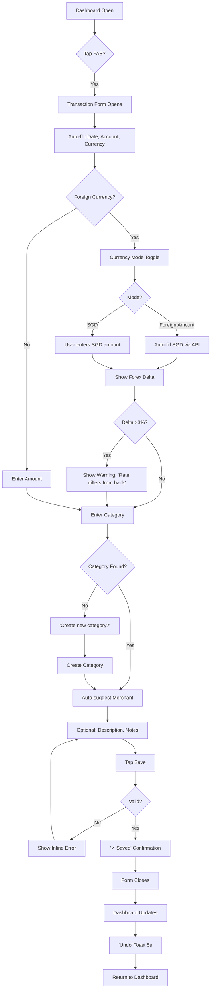
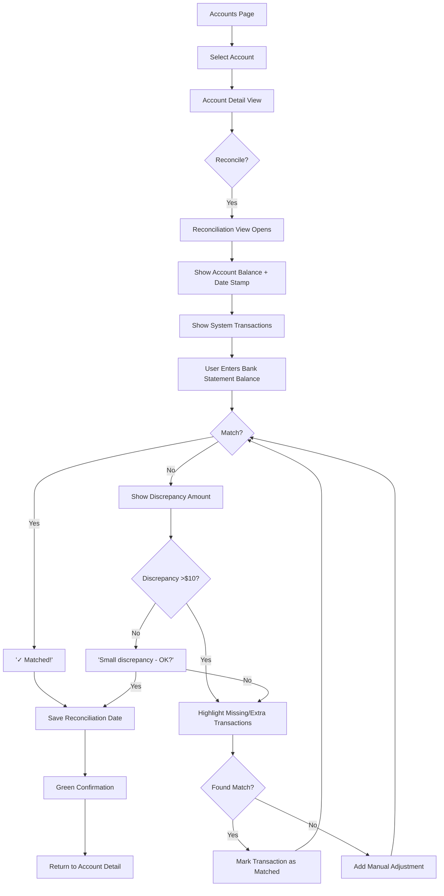
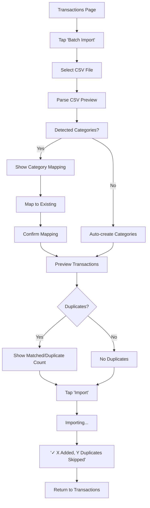

# UX Design Specification — Financial Tracker

**Author:** Ben
**Date:** 2026-05-23

---

## Executive Summary

### Project Vision

A web-based financial tracking application for small households (2-4 members) that automates financial management, provides real-time visual insights, and eliminates spreadsheet complexity — all with zero ongoing hosting costs. The UX must feel futuristic, clean, and empowering — transforming tedious financial tracking into an intuitive, visually engaging experience.

### Target Users

| Role | Count | Tech Level | UX Needs |
|------|-------|------------|----------|
| Primary User (Ben) | 1 | Intermediate | Full system control, advanced features, data management |
| Household Members | 2-4 | Varies | Simple transaction entry, view balances, minimal friction |

**Key User Context:**
- Users need to enter ~100 transactions regularly
- Monthly reconciliation workflow (balance updates, credit card matching)
- Annual data management (archive, export for tax)
- Multi-currency transactions with SGD override
- Recurring payment verification and management

### Implementation Progress Tracking

This section tracks which UI components and patterns have been implemented, providing a bridge between design specification and actual code.

#### Completed Components (Epic 1: Authentication & Security)

| Component | File | Status | Features Implemented |
|-----------|------|--------|----------------------|
| LoginPage | `src/components/LoginPage.tsx` | ✅ Complete | Google OAuth button, session validation, redirect logic |
| Dashboard Page | `src/components/DashboardPage.tsx` | ✅ Complete | Main dashboard shell, navigation skeleton, data fetching hooks |

#### Completed Components (Epic 2: Household Management)

| Component | File | Status | Features Implemented |
|-----------|------|--------|----------------------|
| HouseholdSettingsPage | `src/components/HouseholdSettingsPage.tsx` | ✅ Complete | Household info display, member management, invitation workflow |
| CreateHouseholdModal | `src/components/CreateHouseholdModal.tsx` | ✅ Complete | Modal form for new household creation, validation |
| InviteMemberDialog | `src/components/InviteMemberDialog.tsx` | ✅ Complete | Email input, invitation sending, duplicate detection |
| MembersList | `src/components/MembersList.tsx` | ✅ Complete | Member display, role badges, kick/promote actions |
| PendingInvitations | `src/components/PendingInvitations.tsx` | ✅ Complete | Invitation list, resend/revoke actions, expiry display |
| AcceptInvitationPage | `src/components/AcceptInvitationPage.tsx` | ✅ Complete | Join household flow, invitation validation |

#### Completed Components (Epic 2: Categories)

| Component | File | Status | Features Implemented |
|-----------|------|--------|----------------------|
| CategoryManager | `src/components/CategoryManager.tsx` | ✅ Complete | Full CRUD operations, color picker, icon selector, type toggle |
| Category API Client | `src/api/categories.ts` | ✅ Complete | All 11 endpoint wrappers, TypeScript interfaces, error handling |

#### Implementation Notes

**OAuth Flow (Story 1-1):**
- Google OAuth button triggers redirect to `/auth/google`
- Backend handles server-side OAuth flow with state token CSRF protection
- Callback creates/updates user, establishes session with HTTP-only cookie
- Frontend receives authenticated user via `/auth/me` endpoint
- Session stored in React context (`useAuth` hook)

**Household Management (Story 1-2):**
- On first login, user is prompted to create or join household
- Household creation via `CreateHouseholdModal` with name validation
- Invitation system uses email-based invites with unique tokens
- Members displayed with role badges (Owner/Admin/Member)
- Admin actions: kick member, promote/demote roles

**Security Features (Story 1-3):**
- Session timeout: 30-minute inactivity limit enforced server-side
- CSRF protection: HTTP-only cookies + SameSite attributes
- All API requests include session validation via `/auth/me`
- Logout clears server-side session and redirects to Google sign-out

**Category System (Stories 2-1, 2-2):**
- Default categories seeded on household creation (17 templates)
- Full CRUD: Create, Read, Update, Archive/Restore
- Color picker with preset palette + custom hex input
- Icon selector with emoji library
- Type toggle (Income/Expense) with visual distinction
- Archive pattern (soft delete) with restore capability

#### Implementation Status

See `../implementation-artifacts/sprint-status.yaml` for canonical implementation progress and component completion status.

#### Frontend Architecture Notes

**Component Pattern:**
- All components use React hooks (useState, useEffect, custom hooks)
- API calls centralized in `src/api/` directory with TypeScript interfaces
- Authentication state managed via React Context (`useAuth`)
- Error handling with toast notifications and inline validation messages

**Styling Approach:**
- Tailwind CSS v4 with `@theme {}` design tokens
- Component classes defined in `index.css` under `@layer components {}`
- Dark futuristic theme: #0a0a0f background, #12121a surfaces, vibrant accents
- Responsive design with mobile-first breakpoints

**State Management:**
- Local component state (useState) for form inputs and UI toggles
- React Context for global auth state
- Server state fetched via useEffect on mount, no client-side caching layer yet
- Future consideration: React Query or SWR for data fetching optimization

#### Shared UI Architecture

**Three-Layer Abstraction Pattern:**

All entity management pages follow a three-layer shared abstraction that eliminates duplication and makes the codebase easy to maintain:

```
┌─────────────────────────────────────────────────┐
│  Layer 3: EntityPage (Page Layout)              │
│  ┌───────────────────────────────────────────┐  │
│  │  Header | Action Bar | Archived Toggle    │  │
│  │  ┌─────────────────────────────────────┐  │  │
│  │  │  Layer 2: EntityCard<T> (Row)       │  │  │
│  │  │  ┌───────────────────────────────┐  │  │  │
│  │  │  │ Left | Name | Right | Actions │  │  │  │
│  │  │  └───────────────────────────────┘  │  │  │
│  │  │  (one per entity)                   │  │  │
│  │  └─────────────────────────────────────┘  │  │
│  │  Loading / Error / Empty states           │  │  │
│  └───────────────────────────────────────────┘  │
│  Extensions slot (page-specific extras)         │
└─────────────────────────────────────────────────┘
```

**Layer 1: `useEntityManager<T>` Hook** — Generic CRUD + lifecycle logic (load, create, update, archive, restore, delete, refresh, error handling). Entity-specific APIs are injected via configuration.


1. **Complexity vs. Simplicity** — 12 modules with rich data, but household members need quick, intuitive entry
2. **Multi-Currency UX** — Auto-convert, override, forex delta, and fee tracking must be clear and actionable
3. **Recurring Payment Verification** — Users need to see expected vs. actual occurrences, detect missed payments, and manually trigger when needed
4. **Monthly Reconciliation Workflow** — Balance updates, credit card statement matching, discrepancy highlighting
5. **Information Density** — Dashboard must show comprehensive financial overview without overwhelming

### Design Opportunities

1. **Dark Futuristic Aesthetic** — High-contrast dark theme with vibrant data visualizations creates a premium, modern feel that makes financial tracking engaging
2. **Smart Defaults** — Auto-filled SGD amounts, intelligent category suggestions, and predictive recurring payment patterns reduce user effort
3. **Visual Financial Health** — Real-time charts, histograms, and budget comparisons give immediate insight into financial position
4. **Clean Minimalist Forms** — Progressive disclosure — show only what's needed, reveal advanced options on demand

---

**Design System Direction:**
- **Color Palette**: Dark backgrounds (#0a0a0f, #12121a), bright accent colors for visualizations, category-specific colors
- **Typography**: Clean, modern sans-serif with clear hierarchy
- **Shapes**: Minimalist geometric forms, clean lines, subtle rounded corners
- **Visualizations**: Bright, vibrant charts against dark backgrounds with high contrast
- **Interactions**: Smooth transitions, subtle animations, responsive feedback

---

## Core User Experience

### Defining Experience

The Financial Tracker's core experience centers on **transaction entry** — the single most frequent user action. Users will regularly enter ~100 transactions, making this interaction absolutely critical to get right.

**Primary User Action:** Quick, intuitive transaction entry with smart defaults and minimal friction.

**Core Loop:**
1. User opens the app → sees Dashboard with financial overview
2. Enters a new transaction (or batch of transactions)
3. System auto-categorizes, auto-converts currencies
4. Dashboard updates in real-time with visual feedback
5. Monthly: Reconciliation workflow verifies entries match bank statements

**What Must Be Effortless:**
- Adding a new transaction (3 taps/clicks maximum)
- Manual SGD amount entry (user enters exact bank statement amount, system tracks delta)
- Manual recurring payment creation (user sets up recurring payments proactively)
- Auto-detection of recurring patterns (system suggests from manual entries)
- Balance checking (instant visual feedback)

### Platform Strategy

**Primary Platform:** Web application (React-based)

**Platform Decisions:**
- **Desktop-first** for data entry and reconciliation (larger screen for complex forms, charts)
- **Mobile-responsive** for quick transaction entry on-the-go
- **No offline mode** required — real-time sync with cloud backend
- **Browser-based** — no app store dependencies, instant updates

**Interaction Model:**
- **Mouse/keyboard primary** — forms, tables, chart interactions
- **Touch-friendly** — larger tap targets for mobile entry
- **Keyboard shortcuts** for power users (quick transaction entry)

**Authentication:** Google OAuth 2.0 — seamless login, no separate credentials

### Effortless Interactions

**What Should Feel Magical:**

1. **Smart Transaction Entry**
   - Auto-fill merchant names from previous entries
   - Predictive category suggestions based on merchant
   - One-click duplicate for recurring transactions
   - Batch entry mode for bulk transactions

2. **Currency Conversion with Manual SGD Entry**
   - **Auto-conversion mode:** System auto-fills SGD using daily exchange rate
   - **Manual entry mode:** User enters SGD amount directly from bank statement
   - User sees API rate vs. actual charged amount (when foreign currency entered)
   - One-tap override when bank statement differs from API rate
   - Forex delta automatically calculated and tracked (delta = API amount - manual SGD amount)
   - Toggle between "Enter foreign amount" and "Enter SGD amount" modes

3. **Recurring Payment Management (Manual + Auto-Detection)**
   - **Manual creation:** User proactively sets up recurring payments (frequency, amount, start/end dates)
   - **Auto-detection:** System suggests recurring patterns from manual transaction entries (requires 3+ occurrences)
   - System shows expected vs. actual occurrences
   - Visual indicator when payment is missed
   - One-tap manual trigger for missed payments
   - Smart detection of pattern changes
   - Household members can dispute or confirm detected patterns

4. **Monthly Reconciliation**
   - System suggests matches automatically
   - Visual highlighting of discrepancies
   - One-click approval for matched items
   - Audit trail of all reconciliation actions

5. **Dashboard Insights**
   - Real-time financial health visualization
   - Budget progress with visual thresholds
   - Instant category breakdowns
   - Trend analysis with smart alerts

**Eliminated Friction:**
- No manual currency conversion (system handles it, but user can override with manual SGD entry)
- No separate budget tracking (auto-calculated from transactions)
- Flexible recurring payment setup (manual creation + auto-detection — user chooses)
- No complex export workflows (one-click CSV archive)

### Critical Success Moments

**Moments That Determine Success:**

1. **First Transaction Entry (Day 1)**
   - User enters first transaction in <10 seconds
   - System provides immediate visual feedback
   - Dashboard updates to show financial overview
   - User feels "this is easier than spreadsheets"

2. **First Monthly Reconciliation**
   - System suggests matches automatically
   - User approves 80%+ with one click
   - Discrepancies are clearly highlighted
   - User feels confident in data accuracy

3. **First Recurring Payment Detection**
   - System identifies pattern from manual entries
   - User confirms and system schedules
   - User sees upcoming payments calendar
   - User feels "it's watching over my finances"

4. **Multi-Currency Transaction**
   - User enters foreign amount
   - System shows SGD equivalent instantly
   - User overrides when needed
   - Forex delta tracked automatically
   - User feels "no more calculator needed"

5. **Annual Data Archive**
   - One-click export for tax year
   - CSV download with all transactions
   - System confirms data integrity
   - User feels "organized and compliant"

**Make-or-Break Flows:**
- Transaction entry must be faster than spreadsheet
- Dashboard must load in <2 seconds
- Reconciliation must reduce manual matching by 80%+
- Mobile entry must be usable with one hand

### Experience Principles

**Guiding Principles for All UX Decisions:**

1. **Speed Over Completeness** — Every interaction should complete in <3 clicks. Advanced options are available but hidden by default.

2. **Smart Defaults, Easy Overrides** — System makes intelligent suggestions (categories, currencies, amounts). User can override anything with one tap.

3. **Visual First, Text Second** — Charts, colors, and visual indicators communicate status before text. Text provides detail only when needed.

4. **Progressive Disclosure** — Show only what's needed for the current action. Reveal advanced options on demand. Never overwhelm with complexity.

5. **Instant Feedback** — Every user action produces immediate visual response. Loading states, success confirmations, error messages — all instant and clear.

6. **Trust Through Transparency** — Show where data comes from (exchange rates, categories), how calculations work (forex delta), and what the system is doing (reconciliation progress).

7. **Prove Value Early** — First-time user must experience time-savings within their first 3 transactions. If not, the UX has failed.

8. **Fail Gracefully** — When suggestions are wrong, make correction effortless. Never force users to navigate away from their current task.

9. **Analytics-Driven UX** — Track entry times, abandonment points, and reconciliation completion rates. Iterate based on real data, not assumptions.

### Pre-Mortem Analysis: Failure Prevention

**Identified Failure Modes and Prevention Strategies:**

**1. Transaction Entry Is Still Slow**
- **Prevention:** A/B test entry time vs. spreadsheet; smart defaults must be 90%+ accurate; batch entry must support CSV import; track entry time analytics — alert if average entry exceeds 15 seconds

**2. Multi-Currency Confusion**
- **Prevention:** Show clear comparison (API rate vs. bank rate vs. delta); color-code delta (Green ≤1%, Yellow 1-3%, Red >3%); one-tap "Use bank amount" override; forex delta goes to dedicated "FX Losses" category; first-time currency transaction gets explanatory tooltip; **support manual SGD entry mode (user enters exact bank statement amount, system calculates delta from API rate)**

**3. Recurring Payment Detection Is Unreliable**
- **Prevention:** Require 3+ occurrences before auto-detection; flag missed payments within 3 days; dedicated "Recurring Payments" dashboard widget always visible; weekly digest email for upcoming payments; allow household members to dispute detected patterns; **support manual recurring payment creation as primary method (auto-detection is supplementary)**

**4. Monthly Reconciliation Is Too Complex**
- **Prevention:** Auto-match with confidence scores; one-click bulk approve (90%+ confidence); discrepancies grouped by type; reconciliation progress bar; monthly reconciliation must take <5 minutes

**5. Information Overload on Dashboard**
- **Prevention:** One big number for monthly spending vs. budget; secondary row for income/net; charts are expandable (hidden by default); alerts in colored banner; dashboard loads in <1 second

---

## Desired Emotional Response

### Primary Emotional Goals

**Core Emotional Goal: Empowered and in Control**

Users should feel they have complete mastery over their financial life. The app transforms anxiety about money into confidence through clarity, automation, and visual insight.

**Secondary Emotional Goals:**

1. **Effortless** — Financial tracking should feel as natural as scrolling social media. No friction, no thinking, just doing.

2. **Confident** — Every number displayed should feel trustworthy. Users never second-guess whether the data is accurate.

3. **Accomplished** — After monthly reconciliation, users feel they've completed a meaningful task, not endured a chore.

4. **Calm** — Financial stress is reduced, not amplified. Alerts are helpful, not alarming. The dark theme feels soothing, not oppressive.

5. **Connected** — Household members feel they're managing finances together, not separately. Shared visibility creates alignment, not conflict.

### Emotional Journey Mapping

**Stage 1: First Login (Day 1) — "This is easier than I expected"**
- **Before:** Skeptical, expecting complexity (another spreadsheet tool)
- **During:** Surprised by simplicity — enters first transaction in seconds
- **After:** Intrigued, wants to explore the dashboard
- **Key Moment:** Dashboard loads with real-time visual feedback after first transaction

**Stage 2: First Week — "I actually want to check my finances"**
- **Before:** Habitual, routine-driven
- **During:** Positive reinforcement from dashboard insights
- **After:** Developing a habit — checks app daily without thinking
- **Key Moment:** Receives first smart category suggestion that's exactly right

**Stage 3: First Monthly Reconciliation — "This used to take hours"**
- **Before:** Dread (remembering past spreadsheet reconciliation)
- **During:** Flow state — one-click approvals, clear discrepancy highlighting
- **After:** Accomplishment, relief, confidence in data accuracy
- **Key Moment:** Completes reconciliation in <5 minutes, system shows "100% matched"

**Stage 4: First Recurring Payment Detection — "It's watching over me"**
- **Before:** Manual entry fatigue (entering same payment repeatedly)
- **During:** Surprise and delight when system identifies pattern
- **After:** Trust in the system — feels like having a financial assistant
- **Key Moment:** System flags a missed payment before the user would have noticed

**Stage 5: First Multi-Currency Transaction — "No more calculator"**
- **Before:** Mental math anxiety (converting foreign amounts)
- **During:** Instant clarity — sees SGD equivalent, forex delta, all explained
- **After:** Relief — no more spreadsheet formulas for currency conversion
- **Key Moment:** Enters foreign amount, system shows everything needed in one view

**Stage 6: Annual Data Archive — "I'm organized and compliant"**
- **Before:** Tax season anxiety (gathering receipts, organizing records)
- **During:** One-click export, instant CSV download
- **After:** Peace of mind — data is organized, backed up, ready for accountant
- **Key Moment:** Downloads complete year's data with one click, confirms data integrity

**Stage 7: Returning After a Break — "Pick up right where I left off"**
- **Before:** Guilt (haven't entered transactions in weeks)
- **During:** Non-judgmental welcome — "You have 23 pending transactions"
- **After:** Momentum restored — batch entry mode makes catching up effortless
- **Key Moment:** Dashboard shows "23 transactions pending" with one-click batch import

### Micro-Emotions

**Critical Micro-Emotion Pairs:**

| Situation | Desired Feeling | Avoid Feeling |
|-----------|----------------|---------------|
| Entering first transaction | **Curiosity** — "What will the dashboard show?" | **Intimidation** — "This is too complex" |
| Viewing budget progress | **Motivation** — "I'm under budget, great!" | **Shame** — "I overspent again" |
| Reconciliation matches | **Confidence** — "The system knows what it's doing" | **Doubt** — "Is this match correct?" |
| Forex delta appears | **Understanding** — "Ah, my bank charged less" | **Confusion** — "Where did this number come from?" |
| Recurring payment flagged | **Relief** — "Good thing I caught this" | **Panic** — "I missed a payment!" |
| Dashboard loads slowly | **Patience** — loading animation feels intentional | **Frustration** — "Is it broken?" |
| Batch import succeeds | **Satisfaction** — "23 transactions done in seconds" | **Anxiety** — "Did it work? Where's my data?" |
| Household member adds transaction | **Connection** — "We're managing this together" | **Surprise** — "When did they add that?" |

**Positive Micro-Emotions to Cultivate:**

1. **Small Wins** — Every completed action should feel like progress (budget under threshold, reconciliation step complete)
2. **Clarity** — Complex financial data should feel simple and understandable at a glance
3. **Trust** — Every auto-calculated value should feel reliable and transparent
4. **Control** — User always knows where they stand, what's coming, and what to do next
5. **Pride** — Financial health visualization should make users feel good about their progress

### Design Implications

**Emotion → UX Design Connections:**

1. **Empowerment** → Dashboard shows "one big number" first (monthly spending vs. budget), then drill-down options. User always knows their financial position at a glance.

2. **Effortlessness** — Transaction entry form has only 4 required fields (amount, category, date, account). Everything else is optional or auto-filled. Advanced options hidden behind "More" toggle.

3. **Confidence** — Every auto-calculated value shows its source: "SGD 135.00 (from ExchangeRate-API, May 23)" or "Category: Food (based on 12 previous 'Grab' entries)".

4. **Accomplishment** — Reconciliation shows progress bar ("45 of 100 matched"), completion animation ("All transactions reconciled! 🎉"), and summary ("You saved 3 hours vs. manual entry").

5. **Calm** — Dark theme uses warm blacks (#0a0a0f, #12121a), not harsh pure blacks. Alerts use amber for warnings, red only for critical issues. No flashing, no sudden bright colors.

6. **Connection** — Household activity feed shows "Ben added 3 transactions" or "Sarah reconciled Netflix charge". Shared financial goals visible to all members.

7. **Trust** — Forex delta explanation tooltip: "Your bank charged SGD 133.50, but the API rate would give SGD 135.00. The $1.50 difference is your forex loss, tracked separately."

### Emotional Design Principles

**Guiding Principles for Emotional Design:**

1. **Reduce Anxiety, Not Add to It** — Financial tracking is already stressful. The UX should reduce stress, not amplify it. No red alerts for minor issues. No judgmental language ("You spent too much on food!").

2. **Celebrate Small Wins** — Budget under threshold? Show a subtle green checkmark. Reconciliation complete? Brief celebration animation. Every positive action should feel rewarding.

3. **Transparency Builds Trust** — Never hide how a number is calculated. Show sources, confidence levels, and data origins. If the system makes a suggestion, explain why.

4. **Forgiveness, Not Punishment** — When users make mistakes (wrong category, missed reconciliation), make correction effortless. No error modals, no "are you sure?" dialogs for reversible actions.

5. **Consistency Creates Comfort** — Same interaction patterns throughout. Same color meanings. Same placement of key actions. Users should never wonder "where did that go?"

6. **Delight Through Anticipation** — System should anticipate needs: "You usually pay $800 for HDB mortgage on the 1st — ready to record this month?" Not: "You have no recurring payments set up."

7. **Calm Technology** — Information available when needed, invisible when not. Dashboard shows summary by default, details on demand. No notifications unless action required.

---

## UX Pattern Analysis & Inspiration

### Inspiring Products Analysis

#### Monzo (Banking App)
- **Core Problem Solved:** Makes money feel tangible and immediate
- **Onboarding:** Progressive disclosure — starts with essentials, reveals advanced features as user grows comfortable
- **Navigation:** Bottom tab bar with 5 clear sections — thumb-friendly on mobile
- **Delightful Interactions:** Category color coding; spending insights with visual categories; instant confirmation notifications
- **Visual Design:** Clean background with bold color accents; large typography for balances; micro-animations for confirmations
- **Error Handling:** Graceful fallbacks with "Last updated" timestamp; clear messaging when sync is pending

#### YNAB (You Need A Budget)
- **Core Problem Solved:** Proactive budgeting — gives every dollar a job
- **Onboarding:** Guided setup with real money input; immediate value demonstration
- **Navigation:** Left sidebar with clear hierarchy; category-based organization
- **Delightful Interactions:** Visual goal progress bars; color-coded categories; satisfying budget zeroing animation
- **Visual Design:** Warm but professional; clear visual hierarchy; progress indicators everywhere
- **Error Handling:** Preventive — warns before overspending; shows category status clearly

#### Revolut (Multi-Currency Finance)
- **Core Problem Solved:** Seamless multi-currency management
- **Onboarding:** Instant setup; currency exchange shown with clear rate disclosure
- **Navigation:** Clean bottom nav; currency switcher prominently placed
- **Delightful Interactions:** Real-time exchange rate display; spending by country visualization; instant conversion with visible fees
- **Visual Design:** Dark mode option; clean charts; minimal text, maximum data density
- **Error Handling:** Shows rate expiry time; clear fee breakdown before confirmation

### Transferable UX Patterns

| Pattern | Source | Application to Financial Tracker |
|---------|--------|----------------------------------|
| Category Color Coding | Monzo | Every expense category gets a distinct color; consistent across dashboard, lists, charts |
| Progress Indicators | YNAB | Budget progress bars with color transitions (green → yellow → red) |
| Round-Up Visualization | Monzo | Show forex delta or budget remaining as a visual element |
| Instant Confirmation Feedback | Monzo/Revolut | Satisfying micro-animation on transaction save; visual feedback |
| Progressive Disclosure | Monzo | Show basic info first; advanced options behind expandable section |
| Preventive Warnings | YNAB | Budget threshold alerts; forex delta warning if >3% |
| Real-Time Rate Display | Revolut | Show exchange rate timestamp and source; "Last updated" badge |
| Bottom Tab Navigation | Monzo/Revolut | 5 tabs: Dashboard, Transactions, Budgets, Accounts, Settings |

### Anti-Patterns to Avoid

| Anti-Pattern | Why It Fails | Our Avoidance Strategy |
|--------------|--------------|------------------------|
| Information Overload on First Launch | New users feel overwhelmed by 12 modules | Onboarding shows only Dashboard + Transactions; reveal modules progressively |
| Hidden Fees/Calculations | Users distrust what they can't see | Always show forex delta, fees, and conversions transparently with color coding |
| Silent Failures | User doesn't know if transaction saved | Every action has explicit confirmation (toast message + visual indicator) |
| Complex Multi-Step Workflows | Abandonment rate increases with each step | Keep transaction entry to single screen; advanced options behind "More" section |
| Generic Error Messages | "Something went wrong" provides no value | Specific messaging: "Exchange rate unavailable — using yesterday's rate" |
| Dark Mode Without Contrast | Futuristic dark theme can reduce readability | Ensure WCAG AA contrast ratios; use bright accent colors on dark backgrounds |

### Design Inspiration Strategy

#### What to Adopt:
- **Category Color Coding** — supports instant visual scanning of transaction lists
- **Progressive Disclosure** — 12 modules would overwhelm first-time users
- **Instant Confirmation Feedback** — financial tracking requires trust in data persistence
- **Bottom Tab Navigation** — mobile-first design with thumb-friendly interactions

#### What to Adapt:
- **YNAB's Budget Progress Bars** — modify for dark futuristic aesthetic (neon glow effects)
- **Revolut's Currency Display** — simplify for SGD/foreign mode toggle; show delta prominently
- **Monzo's Round-Up Visualization** — adapt to show forex delta or budget remaining visually

#### What to Avoid:
- **Information Overload** — conflicts with "effortless" experience principle
- **Silent Failures** — doesn't fit trust-first design approach
- **Complex Multi-Step Workflows** — doesn't fit mobile-first, quick-entry requirement

---

## Design System Foundation

### Design System Choice: Themeable System (Tailwind CSS + shadcn/ui)

**Selected Approach:** Themeable system combining Tailwind CSS for utility-first styling with shadcn/ui for accessible, customizable React components.

### Rationale for Selection

1. **Dark Futuristic Aesthetic** — Tailwind's utility-first approach makes custom dark themes straightforward; shadcn/ui provides unstyled, accessible components that we can fully customize to match the dark futuristic vision
2. **Speed + Uniqueness Balance** — Pre-built components (forms, tables, modals, dialogs) save development time while Tailwind allows complete visual customization — critical for our premium, modern feel
3. **Small Team Friendly** — shadcn/ui components are copy-paste based (no heavy dependencies), easy to understand, modify, and maintain by 1-2 developers
4. **Chart.js Integration** — Tailwind doesn't interfere with Chart.js customization; we maintain full control over bright, vibrant data visualizations against dark backgrounds
5. **Long-Term Maintainability** — Simple, transparent codebase; no black-box frameworks; components are explicit and readable

### Implementation Approach

**Core Stack:**
- **Tailwind CSS v4** — Utility classes for layout, spacing, typography, colors, and responsive design (using `@tailwindcss/postcss` plugin)
- **shadcn/ui** — Headless, accessible React components (buttons, inputs, dialogs, tables, cards, navigation)
- **Chart.js** — Custom dark-themed visualizations (already in tech stack)
- **CSS Custom Properties via `@theme {}`** — Design tokens registered directly in CSS; Tailwind v4 auto-generates all utility classes and variants

### CSS Architecture (Tailwind v4)

**CRITICAL: This section documents the correct Tailwind v4 approach for design tokens. Follow this pattern to avoid CSS conflicts.**

#### Single Source of Truth: `@theme {}` in `index.css`

All design tokens are registered in `frontend/src/index.css` using Tailwind v4's `@theme {}` directive. This is the ONLY place where color tokens are defined.

```css
@import "tailwindcss";

@theme {
  --color-background: #0a0a0f;
  --color-surface: #12121a;
  --color-surface-elevated: #1e1e2e;
  --color-border: #2a2a3a;
  --color-primary: #4fc3f7;
  --color-primary-hover: #29b6f6;
  --color-accent: #00e5ff;
  --color-success: #69f0ae;
  --color-warning:ffd740;
  --color-error: #ff5252;
  --color-text: #e0e0e0;
  --color-text-secondary: #888888;
  --color-text-muted: #555555;
  --color-member: #aaaaaa;
}
```

#### How `@theme {}` Works

The `@theme {}` block is the Tailwind v4 mechanism for registering design tokens. When you define a CSS custom property with the `--color-` prefix inside `@theme {}`:

1. **Token Registration**: Tailwind reads the CSS variable and registers it as a color token
2. **Auto-Generated Utilities**: Tailwind automatically generates ALL utility classes for that token:
   - `bg-background`, `bg-surface`, `bg-primary`, etc. (background colors)
   - `text-primary`, `text-error`, `text-text-secondary`, etc. (text colors)
   - `border-border`, `border-primary`, etc. (border colors)
3. **Auto-Generated Variants**: ALL hover/active/focus variants are automatically generated:
   - `hover:text-primary`, `hover:bg-surface-elevated`, `hover:border-accent`
   - `focus:ring-primary`, `active:bg-primary-hover`
4. **Opacity Variants**: Opacity modifiers work automatically:
   - `bg-primary/20`, `bg-warning/30`, `text-text-secondary/50`

#### What NOT To Do

**DO NOT use `@layer utilities` with escaped selectors for color utilities:**
```css
/* ❌ WRONG — These will NOT work in Tailwind v4 */
@layer utilities {
  .hover\:text-primary:hover {
    color: var(--color-primary);
  }
  .hover\:bg-surface-elevated:hover {
    background-color: var(--color-surface-elevated);
  }
}
```

**Why this fails**: Tailwind v4's PostCSS transformation does not properly handle escaped selectors (`.hover\:text-primary:hover`) in `@layer utilities`. The CSS either gets stripped or the selectors don't match the actual class names.

**DO NOT define color tokens in `tailwind.config.js` `theme.extend.colors`:**
```javascript
/* ❌ WRONG — Not needed in Tailwind v4 when using @theme {} */
module.exports = {
  theme: {
    extend: {
      colors: {
        background: '#0a0a0f',
        primary: '#4fc3f7',
        // ... etc
      }
    }
  }
}
```

**Why this fails**: Duplicate token definitions cause conflicts. `@theme {}` in CSS is the authoritative source for Tailwind v4.

#### Correct Pattern Summary

| Layer | Purpose | Example |
|-------|---------|---------|
| `@import "tailwindcss"` | Import Tailwind v4 directives | Replaces old `@tailwind base/components/utilities` |
| `@theme {}` | Register design tokens (colors, spacing, etc.) | `--color-primary: #4fc3f7` → generates `bg-primary`, `text-primary`, `hover:text-primary`, etc. |
| `@layer base {}` | Global styles (body, :root font settings) | `body { background-color: theme(--color-background) }` |
| `@layer components {}` | Custom component classes (badges, cards) | `.badge-owner { background-color: rgba(255, 215, 0, 0.3) }` |

#### File Structure

```
frontend/
├── src/
│   ├── index.css              /* @theme {} tokens, @layer base, @layer components */
│   └── components/
│       ├── DashboardPage.tsx  /* Uses bg-background, text-primary, hover:text-primary */
│       ├── CategoryManager.tsx/* Uses border-border, hover:bg-surface-elevated */
│       └── ...
├── tailwind.config.js         /* Minimal — only fontFamily extension, NO color tokens */
├── postcss.config.js          /* Uses @tailwindcss/postcss plugin */
└── package.json               /* Tailwind CSS 4.1.11, @tailwindcss/postcss 4.3.0 */
```

#### Adding New Theme Tokens

1. Add the token to `@theme {}` in `frontend/src/index.css`:
   ```css
   @theme {
     --color-new-token: #abcdef;  /* Follows --color- naming convention */
   }
   ```
2. Use the utility class directly in any component:
   ```tsx
   <div className="bg-new-token text-white">New Token</div>
   <button className="hover:text-new-token transition-colors">Hover Me</button>
   ```
3. No safelist or manual variant declarations needed — Tailwind v4 generates them automatically.

#### Dynamic Class Generation (Runtime Classes)

For classes generated at runtime (e.g., role badges with conditional colors, dynamic category colors):
- Role badges use `@layer components {}` for custom class definitions (`.badge-owner`, `.badge-admin`)
- Category colors use Tailwind's built-in color palette directly (e.g., `bg-orange-500/20 text-orange-400`)
- No safelist needed for `@theme {}` tokens — they are always available

#### Verification

To verify the theme is working correctly:
1. Open browser DevTools → Elements tab
2. Hover over an element with `hover:text-primary` or similar
3. Check computed styles — the color should resolve to the correct RGB value (e.g., `rgb(79, 195, 247)` for `#4fc3f7`)
4. If hover effects show `rgb(0, 0, 0)` or incorrect values, the CSS architecture is misconfigured

#### Lesson Learned

**Problem**: Initial implementation used `:root {}` for CSS variables + manual `@layer utilities` with escaped selectors for hover variants. Hover effects didn't work across pages.

**Root Cause**: Tailwind v4's PostCSS transformation strips or mangles escaped selectors (`.hover\:text-primary:hover`) in `@layer utilities`. The classes never get generated correctly.

**Solution**: Use `@theme {}` instead of `:root {}` for design tokens. The `--color-` prefix maps directly to Tailwind's color scale, and ALL utilities + variants are auto-generated. No manual declarations needed.

#### Component Classes Reference (`@layer components`)

All reusable UI component classes are defined in `frontend/src/index.css` under `@layer components {}`. These classes encapsulate repeated patterns and ensure visual consistency across all pages. **Components should use these classes instead of inline utility class combinations.**

**Design Philosophy:** Zero inline styles for structural/visual properties. All repeated patterns (cards, inputs, buttons, alerts, badges, modals, navigation, tables) are extracted to named component classes. Only data-driven dynamic styles (e.g., category card colored backgrounds from user-selected colors) remain as inline styles.

---

**Buttons:**

| Class | Purpose | Visual |
|-------|---------|--------|
| `.btn-primary` | Primary action buttons (submit, save, confirm) | Solid primary color fill with 3D shadow effect, hover lifts and brightens |
| `.btn-danger` | Destructive actions (delete, remove, leave) | Solid error color fill with 3D shadow effect, hover lifts and brightens |
| `.btn-secondary` | Secondary action buttons (less prominent than primary, e.g., "Create Default Categories") | Surface-elevated background with border, hover highlights with primary color and subtle glow |
| `.btn-cancel` | Cancel/dismiss actions in forms and modals | Transparent with border, hover fills with surface-elevated |
| `.btn-action-primary` | Small outlined action buttons (edit, view, accept) | Transparent with primary border, hover adds primary tint |
| `.btn-action-error` | Small outlined danger buttons (decline, reject) | Transparent with error border, hover adds error tint |
| `.btn-action-success` | Small outlined success buttons (confirm, approve) | Transparent with success border, hover adds success tint |
| `.btn-ghost` | Minimal tertiary actions (utility buttons, test pages) | Transparent with subtle border, hover adds primary tint and color change |
| `.btn-remove` | Inline remove/delete buttons (list items, table rows) | Tinted error background with error border, hover increases tint |
| `.btn-close` | Modal/dialog close button | Large × symbol, text-secondary color, hover brightens |

**Button Usage Guidelines:**

- **Primary actions only**: Use `.btn-primary` for the single most important action on a page (save, submit, confirm)
- **Secondary actions**: Use `.btn-secondary` for supporting actions that are still important (e.g., "Create Default Categories", batch operations)
- **Cancel/dismiss**: Use `.btn-cancel` for canceling or dismissing modal dialogs and forms
- **Small inline actions**: Use `.btn-action-*` classes for compact outlined buttons in tables, lists, or toolbars
- **Minimal actions**: Use `.btn-ghost` for tertiary utility actions that should not compete with primary or secondary buttons
- **Destructive actions**: Use `.btn-danger` for destructive operations (delete household, remove member) or `.btn-remove` for inline list deletions
- **Close actions**: Use `.btn-close` exclusively for modal/dialog close buttons (× symbol)

**DO NOT:**
- Create ad-hoc button styles with inline utility classes (e.g., `bg-primary text-background rounded px-4 py-2`)
- Mix button class types for the same action across different components
- Use `.btn-cancel` where `.btn-secondary` is more appropriate — `.btn-cancel` is specifically for cancel/dismiss patterns

**Badges:**

| Class | Purpose | Visual |
|-------|---------|--------|
| `.badge-owner` | Owner role indicator | Gold tinted background with gold text and border |
| `.badge-admin` | Admin role indicator | Cyan accent tinted background with accent text and border |
| `.badge-member` | Member role indicator | Gray tinted background with gray text and border |
| `.badge-warning` | Warning status badge | Warning tinted background with warning text and border |
| `.badge-success` | Success status badge | Success tinted background with success text and border |
| `.badge-error` | Error status badge | Error tinted background with error text and border |
| `.badge-text-muted` | Inactive/disabled status badge | Muted tinted background with muted text and border |

**Cards and Containers:**

| Class | Purpose | Visual |
|-------|---------|--------|
| `.card` | Standard card container | Surface background, border, rounded corners, 1.5rem padding |
| `.invite-card` | Invitation list item | Flex row layout with hover border highlight in primary |
| `.modal-content` | Modal/dialog content area | Surface background, border, max-width 28rem, max-height 90vh, column flex |
| `.category-card` | Category management card | Flex row with dynamic border color (transparent by default), hover highlights |

**Alerts:**

| Class | Purpose | Visual |
|-------|---------|--------|
| `.alert-error` | Error message container | 10% error background tint, error border, error text |
| `.alert-success` | Success message container | 10% success background tint, success border, success text |
| `.alert-warning` | Warning message container | 10% warning background tint, warning border, warning text |

**Form Elements:**

| Class | Purpose | Visual |
|-------|---------|--------|
| `.input` | Standard text input | Full-width, surface-elevated background, border, primary focus ring |
| `.input-error` | Error state input modifier | Same as `.input` but with error-colored focus ring |
| `.select` | Dropdown select input | Same as `.input` with appearance:none for custom dropdown |
| `.textarea` | Multi-line text input | Same as `.input` with resize:none |
| `.label` | Form field label | Block display, small font, text-secondary color |
| `.select-sm` | Small inline select (e.g., role dropdown) | Compact padding, background background, smaller border radius |

**Navigation:**

| Class | Purpose | Visual |
|-------|---------|--------|
| `.nav-link` | Simple navigation link | text-secondary with primary hover color transition |
| `.nav-item` | Navigation item with background | Padded block with surface-elevated hover background and primary hover text |
| `.nav-item-danger` | Danger navigation action (e.g., logout) | Same as `.nav-item` but with error hover color |
| `.header-bar` | Page header container | Surface background, bottom border, horizontal padding |

**Tables:**

| Class | Purpose | Visual |
|-------|---------|--------|
| `.table-header-cell` | Table column header | Left-aligned, text-secondary, medium weight, padded |
| `.table-row` | Table data row | Bottom border, surface-elevated hover background |
| `.table-cell` | Table data cell | Padded, text-secondary color |

**Tags and Chips:**

| Class | Purpose | Visual |
|-------|---------|--------|
| `.tag` | Base tag/chip element | Inline-block, small font, rounded-full pill shape |
| `.tag-success` | Success state tag modifier | 10% success background tint with success text |
| `.tag-error` | Error state tag modifier | 10% error background tint with error text |
| `.tag-primary` | Primary state tag modifier | 10% primary background tint with primary text |

**Icon Buttons:**

| Class | Purpose | Visual |
|-------|---------|--------|
| `.icon-btn` | Base icon button (edit, delete, etc.) | Padded, no border/background, text-secondary, primary hover |
| `.icon-btn-error` | Error action icon button | Same as `.icon-btn` but with error hover color |
| `.icon-btn-success` | Success action icon button | Same as `.icon-btn` but with success hover color |

**Utility Components:**

| Class | Purpose | Visual |
|-------|---------|--------|
| `.section-divider` | Horizontal section separator | Top border in border color |
| `.danger-zone` | Destructive action section separator | Top border with 30% error tint |
| `.empty-state` | Empty list/message placeholder | Centered text, large vertical padding, text-secondary |
| `.toast-success` | Success notification toast | Fixed bottom-right, surface-elevated background, success border and text, shadow |
| `.color-swatch` | Color picker swatch | 3rem circle with border, pointer cursor |

---

**Usage Pattern:**

```tsx
// ✅ CORRECT — Use component classes
<div className="card">
  <label className="label">Email</label>
  <input className="input" type="text" />
  <button className="btn-primary">Submit</button>
</div>

// ❌ WRONG — Don't repeat inline utility patterns
<div className="bg-surface border border-border rounded-lg p-6">
  <label className="block text-sm font-medium text-text-secondary mb-2">Email</label>
  <input className="w-full px-4 py-2 bg-surface-elevated..." type="text" />
  <button className="bg-primary text-background...">Submit</button>
</div>
```

**Adding New Component Classes:**

1. Identify a repeated pattern (3+ occurrences of the same utility class combination)
2. Extract to a named class in `@layer components {}` in `index.css`
3. Use descriptive names: `.btn-*` for buttons, `.badge-*` for badges, `.alert-*` for alerts
4. Reference design tokens via `theme(--color-*)` instead of hardcoded colors
5. Replace all existing occurrences with the new class name

**Component Strategy:**
- Use shadcn/ui for foundational components (Button, Input, Dialog, Table, Card, Select)
- Customize all components to match dark futuristic aesthetic (override default light theme styles)
- Build custom components for financial-specific UI (Transaction Form, Budget Progress Bar, Currency Toggle)
- Chart.js configured with dark theme (dark grid lines, bright data series, high contrast)

### Customization Strategy

**What We Customize:**
- **Color Palette** — Dark backgrounds (#0a0a0f, #12121a), bright accent colors (#00d4ff, #7c4dff), category-specific colors
- **Typography** — Clean Inter font with clear hierarchy (bold numbers, muted labels)
- **Shapes** — Minimalist geometric forms, clean lines, subtle rounded corners (8px border radius)
- **Visualizations** — Bright, vibrant charts against dark backgrounds with high contrast
- **Interactions** — Smooth transitions, subtle animations, responsive feedback

**What We Keep from shadcn/ui:**
- Accessibility (ARIA attributes, keyboard navigation, focus management)
- Component structure (form validation, dialog behavior, table sorting)
- Responsive patterns (mobile-first breakpoints)

**What We Avoid:**
- shadcn/ui's default light theme styling (override everything)
- Material Design patterns (conflicts with our minimalist aesthetic)
- Heavy component libraries (keep bundle size small for fast loading)

---

## 2. Core User Experience

### Defining Experience: Effortless Transaction Entry

**The Core Interaction: "Enter a transaction in under 5 seconds"**

The Financial Tracker's defining experience is **effortless transaction entry** — the single interaction that users will describe to their friends. If we get this right, the dashboard insights, reconciliation, and all other features become meaningful.

**How users will describe it:**
> "I just open the app, type the amount, pick a category, and done. The dashboard updates instantly."

**The interaction that makes users feel successful:**
- They enter their first transaction and see the dashboard come alive with real data
- They enter 100 transactions faster than they would in a spreadsheet
- They discover the system auto-categorized and auto-converted everything

### User Mental Model

**How users currently solve this problem:**
- **Spreadsheet entry** — Manual rows, formulas for totals, manual currency conversion
- **Bank apps** — View-only, can't organize or budget across accounts
- **YNAB/Mint** — Good but complex, require onboarding, feel like "work"

**Mental model users bring:**
- "I need to track where my money goes"
- "I enter amount, category, date"
- "I need to see totals and trends"
- "Currency conversion is annoying"

**Expectations:**
- Fast entry (comparable to spreadsheet)
- Smart suggestions (don't make me re-enter categories)
- Visual feedback (show me the result immediately)
- No learning curve (if they've used any banking app, they should understand this)

**Where they get frustrated:**
- Too many fields to fill
- Slow loading between steps
- Unclear where data went after saving
- Manual currency conversion math

### Success Criteria

**What makes users say "this just works":**

1. **Speed** — First transaction entered in <5 seconds from app open
2. **Smart Defaults** — 90%+ of fields auto-filled (merchant, category, currency)
3. **Instant Feedback** — Dashboard updates within 500ms of save
4. **Forgiveness** — Wrong category? One tap to change, no navigation away
5. **Clarity** — User always knows where their data is stored and what it shows

**Success Indicators:**
- Average transaction entry time <8 seconds (vs. 15-30s for spreadsheet)
- First-time user completes 5 transactions without asking for help
- 80%+ of users return within 7 days (habit formation)

### Novel vs. Established Patterns

**This combines familiar patterns in innovative ways:**

**Established Patterns We Use:**
- Form-based data entry (familiar from banking apps)
- Category selection with color coding (familiar from budgeting apps)
- Real-time dashboard updates (familiar from analytics tools)

**Novel Twists:**
- **Currency mode toggle** — Switch between foreign/SGD entry without leaving the form (uncommon in budgeting apps)
- **Forex delta visualization** — Show the difference between API rate and bank rate as a visual element (unique to our multi-currency focus)
- **Batch entry with smart deduplication** — Import CSV, system auto-matches existing transactions (faster than any consumer app)

**Teaching Strategy:**
- No onboarding tutorial needed — form looks like any banking app
- First currency transaction gets a subtle tooltip explaining the toggle
- First batch import shows "3 matched, 0 duplicates" confirmation

### Experience Mechanics

**Step-by-Step Flow for Transaction Entry:**

**1. Initiation:**
- User opens app → lands on Dashboard
- Clicks "Add Transaction" button (floating action button, always visible)
- OR clicks "Quick Add" from dashboard widget
- OR uses keyboard shortcut (Ctrl+T for power users)

**2. Interaction:**
- Form slides up from bottom (mobile) or appears as centered modal (desktop)
- **Auto-filled fields:**
  - Date defaults to today
  - Account defaults to last used account
  - Category suggests based on merchant name (if recognized)
  - Currency defaults to account's base currency
- **User enters:**
  - Amount (required)
  - Category (required, with search/autocomplete)
  - Description (optional, auto-suggested from merchant)
  - Notes (optional)
- **Currency mode toggle** (if foreign currency):
  - "Foreign Amount" mode → auto-fills SGD using API rate
  - "SGD" mode → user enters exact bank statement amount
  - Delta displayed with color coding (green/yellow/red)

**3. Feedback:**
- As user types: category suggestions appear instantly
- On save: form shows "✓ Saved" confirmation (500ms)
- Dashboard updates: transaction appears in recent list, totals update
- Micro-animation: subtle pulse on dashboard numbers

**4. Completion:**
- Form closes automatically after save
- User returns to updated Dashboard
- "Undo" toast appears for 5 seconds (in case of mistake)
- If batch import: shows "X transactions added, Y duplicates skipped"

**Error Handling:**
- Invalid amount → inline field error (red border, "Enter a valid amount")
- Network failure → "Save failed — retry?" button (no modal)
- Category not found → "Create new category?" prompt

---

## Visual Design Foundation

### Color System

**Design Direction: Dark Futuristic**

The Financial Tracker uses a dark-first design that feels premium, modern, and easy on the eyes during extended use. The dark palette reduces eye strain for users who check finances frequently, while bright accent colors make data visualization pop.

**Base Colors:**

| Token | Hex | Usage |
|-------|-----|-------|
| Background Primary | #0a0a0f | Main app background |
| Background Secondary | #12121a | Cards, panels, modals |
| Background Tertiary | #1a1a2e | Hover states, elevated surfaces |
| Border Subtle | #2a2a3e | Dividers, borders |
| Border Strong | #3a3a5e | Active elements, focus rings |
| Text Primary | #ffffff | Headings, primary text |
| Text Secondary | #a0a0b0 | Labels, descriptions |
| Text Tertiary | #6a6a7a | Placeholders, disabled |

**Accent Colors (Categories & Data):**

| Token | Hex | Usage |
|-------|-----|-------|
| Accent Primary | #6366f1 | Primary actions, links, focus rings |
| Accent Secondary | #8b5cf6 | Secondary actions |
| Accent Tertiary | #06b6d4 | Tertiary actions |

**Semantic Colors:**

| Token | Hex | Usage |
|-------|-----|-------|
| Success | #10b981 | Positive amounts, completed states |
| Warning | #f59e0b | Budget thresholds, forex delta 1-3% |
| Error | #ef4444 | Negative amounts, errors, overdue |
| Info | #3b82f6 | Informational messages, category colors |

**Category Colors (17 Default Category Templates — created on-demand via "Create Default Categories" button):**

| Category | Color | Hex |
|----------|-------|-----|
| Groceries | Orange | #f97316 |
| Transport | Blue | #3b82f6 |
| Utilities | Cyan | #06b6d4 |
| Entertainment | Pink | #ec4899 |
| Healthcare | Green | #10b981 |
| Education | Indigo | #6366f1 |
| Shopping | Purple | #8b5cf6 |
| Dining | Amber | #f59e0b |
| Travel | Teal | #14b8a6 |
| Bills | Rose | #f43f5e |
| Savings | Emerald | #10b981 |
| Other | Gray | #6b7280 |

**Forex Delta Visualization:**

| Delta | Color | Meaning |
|-------|-------|---------|
| ≤1% | #10b981 (green) | Negligible variance — "good rate" |
| 1-3% | #f59e0b (amber) | Moderate variance — "watch" |
| >3% | #ef4444 (red) | Significant variance — "review" |

**Accessibility:**
- All text meets WCAG AA contrast ratios (4.5:1 minimum)
- Semantic colors used with icons (not color alone) for color-blind users
- Focus rings use Accent Primary (#6366f1) with 2px solid border + 4px glow

### Typography System

**Font Family: Inter (Primary) + JetBrains Mono (Numbers)**

**Rationale:**
- **Inter** — Modern, highly readable sans-serif optimized for screen display. Excellent number glyphs. Free (SIL Open Font License).
- **JetBrains Mono** — Monospace font for financial data. Numbers align vertically in tables. Distinctive character shapes reduce confusion (0 vs O, 1 vs l).

**Type Scale:**

| Level | Size | Weight | Line Height | Usage |
|-------|------|--------|-------------|-------|
| H1 | 28px | 700 | 1.2 | Page titles |
| H2 | 24px | 600 | 1.3 | Section headers |
| H3 | 20px | 600 | 1.3 | Card titles |
| H4 | 16px | 600 | 1.4 | Subsection headers |
| Body | 14px | 400 | 1.5 | Primary text |
| Small | 12px | 400 | 1.4 | Labels, captions |
| Tiny | 11px | 400 | 1.3 | Metadata, timestamps |

**Font Usage Rules:**

- **All amounts** — JetBrains Mono, right-aligned in tables
- **Account balances** — JetBrains Mono, bold (600)
- **Transaction descriptions** — Inter, regular (400)
- **Category labels** — Inter, medium (500)
- **Dates** — Inter, regular (400)
- **Percentages** — JetBrains Mono, regular (400)

**Accessibility:**
- Minimum body text size: 14px (never scale below)
- Line height ≥1.4 for all readable content
- No justified text (left-aligned only)
- Support user font-size preferences (up to 200% zoom)

### Spacing & Layout Foundation

**Base Unit: 4px Grid**

All spacing derives from 4px multiples for consistency:

| Token | Value | Usage |
|-------|-------|-------|
| xs | 4px | Tight spacing (icon + label) |
| sm | 8px | Compact spacing (form fields) |
| md | 12px | Standard spacing (card padding) |
| lg | 16px | Comfortable spacing (section gaps) |
| xl | 24px | Generous spacing (page margins) |
| 2xl | 32px | Large spacing (section dividers) |
| 3xl | 48px | Maximum spacing (page padding) |

**Layout Principles:**

1. **Mobile-First** — Design for 375px width first, then expand. All layouts must work on smallest supported devices.

2. **Card-Based Organization** — Each module (Budgets, Accounts, etc.) uses card-based layout with consistent padding (md = 12px internal, lg = 16px external).

3. **Data Density Balance** — Tables show 6-8 rows per viewport (no scrolling on desktop). Pagination or virtual scrolling for larger datasets.

4. **Consistent Margins** — Page content centered with 3xl (48px) side margins on desktop, full-width on mobile.

5. **Floating Action Button** — Primary action ("Add Transaction") always visible as FAB (Accent Primary color) in bottom-right corner on mobile, top-right on desktop.

**Component Spacing:**

- **Form fields** — 8px gap between fields, 12px padding inside
- **Cards** — 12px internal padding, 16px external margin
- **Buttons** — 12px horizontal padding, 8px vertical padding
- **Lists** — 8px between items, 12px internal padding
- **Charts** — 16px padding around chart area, 24px external margin

### Accessibility Considerations

**WCAG AA Compliance:**
- All text meets 4.5:1 contrast ratio against background
- Interactive elements have visible focus indicators (2px solid border + 4px glow)
- Color is never the sole means of conveying information (icons + text + color)

**Keyboard Navigation:**
- Full keyboard navigation support (Tab, Shift+Tab, Enter, Escape)
- Logical tab order matching visual layout
- Skip-to-content link for power users
- Focus trap in modals

**Screen Reader Support:**
- Semantic HTML landmarks (nav, main, article, section)
- ARIA labels for icon-only buttons
- Live regions for dynamic updates (dashboard totals)
- Descriptive link text (not "Click here")

**Reduced Motion:**
- Respect `prefers-reduced-motion` system preference
- Disable animations for users who prefer reduced motion
- Maintain functionality without animations

**Color-Blind Friendly:**
- Category colors chosen for color-blind accessibility
- Status indicators use shape + color (✓ green, ⚠ amber, ✗ red)
- Charts use patterns + colors (not colors alone)

---

## Design Direction Decision

### Design Directions Explored

**Four design directions were explored for the Financial Tracker:**

**Direction 1: Dashboard-First**
- Dashboard dominates the screen with large charts and metrics
- Transaction entry is a secondary action (button in corner)
- Best for: users who want insights first, entry second
- Trade-off: entry feels buried, requires extra clicks

**Direction 2: Entry-First**
- Transaction form is the primary interface
- Dashboard is a summary view (compact metrics at top)
- Best for: users who enter data frequently, want speed
- Trade-off: insights feel secondary, charts are small

**Direction 3: Hybrid (CHOSEN)**
- Balanced dashboard and entry, context-aware layout
- Dashboard as default landing, entry always one tap away
- Best for: mixed usage patterns (entry + review)
- Trade-off: requires more complex layout logic

**Direction 4: Minimalist**
- Ultra-clean, maximum whitespace, only essentials visible
- Charts hidden behind "expand" actions
- Best for: users who prefer simplicity over power
- Trade-off: power users miss quick access to features

### Chosen Direction: Hybrid (Direction 3)

**Layout Structure:**

**Default View (Dashboard):**
```
┌─────────────────────────────────────────────────┐
│  [☰] Financial Tracker                    [👤]  │
├─────────────────────────────────────────────────┤
│  Total Balance    Monthly Spending   Upcoming   │
│  $12,450.00       $2,340.50        3 payments  │
├─────────────────────────────────────────────────┤
│  Spending by Category              Recent       │
│  [Chart: pie/donut]                  Trans.     │
│                                          [Quick  │
│                                          Add]    │
├─────────────────────────────────────────────────┤
│  Recent Transactions                            │
│  • Grocery Store        -$45.20  Today          │
│  • Salary Deposit       +$3,200.00  Yesterday  │
│  • Electric Bill        -$120.00  2 days ago   │
└─────────────────────────────────────────────────┘
              [ + ] FAB
```

**Key Elements:**
- **Top Bar** — App name, hamburger menu (left), user avatar (right)
- **Metrics Row** — 3 key metrics in compact cards (balance, spending, upcoming)
- **Main Content** — Split layout: charts (left 60%), recent transactions (right 40%)
- **Bottom** — Floating Action Button (FAB) for quick transaction entry
- **Sidebar** — Slides in from left on menu tap, shows module icons + labels

**Context-Aware Behavior:**
- **First visit of day** — Shows full dashboard with all charts
- **After entry** — Shows confirmation toast, returns to dashboard
- **Repeat visits** — Remembers last viewed module, shows that view
- **Power user mode** — Keyboard shortcuts enabled, compact view available

### Design Rationale

**Why Hybrid Wins:**

1. **Matches User Behavior** — Users enter transactions AND review insights. Neither should feel secondary.

2. **Fast Entry, Rich Review** — FAB gives instant entry access. Dashboard provides rich review context.

3. **Scales with Complexity** — Simple view for casual users. Expandable charts and sidebar for power users.

4. **Emotional Alignment** — Dashboard shows progress (empowering). Quick entry feels effortless (in control).

5. **Competitive Differentiation** — Most apps force you to choose: entry-focused OR insight-focused. Hybrid does both.

**Implementation Principles:**

- **Progressive Disclosure** — Show essentials first, reveal complexity on demand
- **Consistent Spacing** — All layouts use 4px grid, no exceptions
- **Mobile Parity** — Desktop and mobile have feature parity (no "mobile version" compromises)
- **Performance First** — Dashboard loads in <1s, charts render in <500ms

### Implementation Approach

**Component Structure:**

```
App
├── TopBar (fixed)
│   ├── HamburgerMenu → Sidebar
│   ├── AppTitle
│   └── UserAvatar → Dropdown
├── Sidebar (slide-in, 280px wide)
│   ├── ModuleNav (icons + labels)
│   └── UserMenu
├── MainContent (flexible)
│   ├── DashboardView (default)
│   │   ├── MetricsRow (3 cards)
│   │   ├── ChartsPanel (expandable)
│   │   └── RecentTransactions (list)
│   ├── ModuleView (Budgets, Accounts, etc.)
│   │   ├── ModuleHeader (title + actions)
│   │   ├── DataGrid (table/list)
│   │   └── ModuleCharts (optional)
│   └── TransactionForm (modal/slide-up)
│       ├── CurrencyToggle
│       ├── FormFields
│       └── SaveButton
└── FAB (fixed bottom-right)
    └── "Add Transaction"
```

**Responsive Breakpoints:**

| Breakpoint | Width | Layout |
|------------|-------|--------|
| Mobile | < 640px | Single column, FAB bottom-right, sidebar full-screen |
| Tablet | 640-1024px | Two-column dashboard, FAB bottom-right, sidebar slide-in |
| Desktop | > 1024px | Three-column dashboard, FAB top-right, sidebar always visible (collapsible) |

**Animation Guidelines:**

- **Sidebar slide-in** — 200ms ease-out
- **Form modal** — 150ms ease-out (fade + slide up)
- **Dashboard updates** — 300ms fade-in for new transactions
- **Chart transitions** — 500ms ease-in-out for data changes
- **FAB press** — 100ms scale-down feedback

---

## User Journey Flows

### Daily Transaction Entry

**Journey Overview:** User enters a transaction from the dashboard and sees immediate visual feedback.

**Entry Point:** Dashboard → Floating Action Button (FAB)

**Mermaid Flow Diagram:**



**Step-by-Step Flow:**

| Step | User Action | System Response | Time |
|------|-------------|-----------------|------|
| 1 | Tap FAB | Form slides up (150ms) | <200ms |
| 2 | System auto-fills defaults | Date=today, Account=last used, Currency=base | Instant |
| 3 | Enter amount | Category suggestions appear | <100ms |
| 4 | Select category | Merchant auto-suggested | <100ms |
| 5 | (Optional) Edit description/notes | No feedback needed | — |
| 6 | Tap Save | "✓ Saved" confirmation (500ms) | <500ms |
| 7 | Form closes | Dashboard updates with new transaction | <500ms |
| 8 | "Undo" toast appears | Available for 5 seconds | 5s |

**Optimization Principles:**
- **Zero navigation** — Form opens over dashboard, closes back to dashboard
- **Smart defaults** — 80% of fields pre-filled, user only enters amount + category
- **Instant feedback** — Every action has visual confirmation
- **Forgiveness** — Undo toast for 5 seconds after save

### Monthly Reconciliation

**Journey Overview:** User reconciles an account at month end, matching system records with bank statement.

**Entry Point:** Accounts → Select Account → Reconcile Button

**Mermaid Flow Diagram:**



**Step-by-Step Flow:**

| Step | User Action | System Response | Time |
|------|-------------|-----------------|------|
| 1 | Navigate to Accounts | List of accounts shown | <500ms |
| 2 | Select account | Account detail view opens | <500ms |
| 3 | Tap "Reconcile" | Reconciliation view opens | <500ms |
| 4 | System shows balance + date | Date stamp: "Last reconciled: [date]" | Instant |
| 5 | Enter bank statement balance | System calculates discrepancy | <200ms |
| 6a | Match (discrepancy = $0) | Green "✓ Matched!" confirmation | <500ms |
| 6b | Mismatch (discrepancy >$10) | Highlight potential missing transactions | <500ms |
| 7 | Review highlighted transactions | User can mark as matched or add adjustment | — |
| 8 | Confirm reconciliation | Date stamp saved, green confirmation | <500ms |
| 9 | Return to account detail | Balance updated, reconciliation date shown | <500ms |

**Optimization Principles:**
- **Guided process** — System highlights likely matches, user confirms
- **Threshold awareness** — Small discrepancies (<$10) treated as rounding; large ones flagged
- **Manual override** — User can add adjustment transaction for unexplained differences
- **Date tracking** — Last reconciliation date always visible for audit trail

### CSV Import with Category Mapping

**Journey Overview:** User imports transactions from bank CSV files. System auto-creates new categories and prompts user to map imported categories to existing ones.

**Entry Point:** Transactions → Batch Import → CSV

**Mermaid Flow Diagram:**



**Step-by-Step Flow:**

| Step | User Action | System Response | Time |
|------|-------------|-----------------|------|
| 1 | Navigate to Transactions | Transactions page shown | <500ms |
| 2 | Tap "Batch Import" | File picker opens | Instant |
| 3 | Select CSV file | CSV parsed, preview shown | <2s |
| 4 | Review detected categories | Category mapping view opens | — |
| 5 | Map categories (or auto-create) | Mapping confirmed | Instant |
| 6 | Review transaction preview | Shows all transactions with mapped data | — |
| 7 | Tap "Import" | Import starts | — |
| 8 | System processes import | Progress indicator shown | <5s |
| 9 | Import complete | "✓ X Added, Y Duplicates Skipped" toast | <500ms |
| 10 | Return to Transactions | Transactions list updated | — |

**Category Mapping UI:**

```
CategoryMappingView
├── Header: "Map Categories from Import"
├── CategoryList
│   ├── Imported Category (e.g., "Food & Dining")
│   ├── Dropdown: Select existing category or "Create New"
│   ├── Preview: "12 transactions will use this category"
│   └── Skip checkbox (leave unassigned)
└── ImportButton (once all mappings complete)
```

**Behavior:**
- CSV file parsed and preview shown before import
- New category names from CSV are auto-created in the system
- User can map imported categories to existing categories (e.g., "Food" → "Food & Dining", "Groceries" → "Food & Dining")
- User can choose "Create New" for categories not in system
- User can skip categories (transactions left unassigned)
- Duplicate detection: system auto-matches existing transactions (date + amount + description)
- Shows "X matched, Y duplicates skipped" confirmation
- Auto-created categories use default icon/color until user customizes

### Annual Data Export

**Journey Overview:** User exports a year's worth of data as CSV for tax preparation or personal records.

**Entry Point:** Settings → Export Data

**Mermaid Flow Diagram:**

```mermaid
graph TD
    A[Settings Page] --> B[Select 'Export Data']
    B --> C[Export Options View]
    C --> D[Select Year Range]
    D --> E{Year Range?}
    E -->|Single Year| F['Export [Year] Data']
    E -->|Custom Range| G[Select Start + End Year]
    G --> H['Export [Start] - [End] Data']
    F --> I{Format?}
    H --> I
    I -->|CSV| J[CSV Format Selected]
    I -->|JSON| K[JSON Format Selected]
    J --> L[Show Preview: 'X transactions, Y accounts']
    K --> L
    L --> M[Tap 'Download']
    M --> N[Generate File]
    N --> O['Downloading...']
    O --> P['✓ Download Complete']
    P --> Q[File saved to Downloads]
    Q --> R[Return to Settings]
```

**Step-by-Step Flow:**

| Step | User Action | System Response | Time |
|------|-------------|-----------------|------|
| 1 | Navigate to Settings | Settings page shown | <500ms |
| 2 | Tap "Export Data" | Export options view opens | <500ms |
| 3 | Select year range | Year picker shown (default: current year) | — |
| 4 | Select format (CSV/JSON) | Format selected | Instant |
| 5 | Tap "Download" | File generation starts | — |
| 6 | System generates file | Progress indicator shown | <2s |
| 7 | Download complete | "✓ Download Complete" toast | <500ms |
| 8 | File saved to Downloads | User can open from Downloads folder | — |

**Optimization Principles:**
- **Default to current year** — Most common case, one tap to select
- **Preview before download** — Shows transaction count so user knows what to expect
- **CSV default** — Most compatible format for tax software
- **Batch export** — All modules included in single file (transactions, accounts, budgets, etc.)
- **JSON export** — Full data export including categories, accounts, budgets for backup

**NFR Considerations:**
- **Session Timeout**: Export session expires after 30 minutes of inactivity; user must re-authenticate to restart export
- **Data Retention**: Exported data includes all historical records; no automatic data deletion occurs during export
- **PWA Support**: Exported files download to device storage; PWA-enabled devices can save to cloud storage (Google Drive, iCloud)
- **File Size Limits**: CSV exports capped at 50MB per year; multi-year exports split into separate files
- **Download Security**: Exported files include user email header for audit trail; encrypted export option available (future)

### Journey Patterns

**Cross-Journey Patterns Identified:**

| Pattern | Application | Consistency Rule |
|---------|-------------|------------------|
| Confirmation Toasts | All save actions | Green checkmark + "✓ Saved" + 5s duration |
| Undo Availability | Transaction save, delete | 5-second undo window |
| Auto-fill Defaults | Transaction form, reconciliation | Last used values as defaults |
| Inline Errors | Form validation | Red border + descriptive message below field |
| Loading States | Dashboard load, export | Skeleton screens (not spinners) |
| Empty States | No transactions, no budgets | Illustration + "Add your first [item]" CTA |

**Navigation Patterns:**

| Pattern | Rule |
|---------|------|
| FAB placement | Bottom-right (mobile), top-right (desktop) |
| Sidebar navigation | Icons + labels, active state highlighted |
| Back navigation | System back button (mobile), breadcrumb (desktop) |
| Module switching | Sidebar click, no page reload |

**Feedback Patterns:**

| Pattern | Rule |
|---------|------|
| Success | Green checkmark toast, 5 seconds |
| Error | Red inline error, persistent until fixed |
| Loading | Skeleton screen matching content layout |
| Warning | Amber icon + text, non-blocking |
| Info | Blue info icon, dismissible |

### Flow Optimization Principles

**Efficiency Principles:**

1. **Three-Tap Rule** — Any feature reachable within 3 taps from dashboard
2. **Smart Defaults** — 80%+ of fields pre-filled based on history
3. **Progressive Disclosure** — Advanced options hidden by default, revealed on demand
4. **Forgiveness** — Undo available for all destructive actions (5-second window)
5. **Instant Feedback** — Every user action has visual response within 500ms

**Delight Principles:**

1. **Micro-animations** — Subtle transitions on save, update, navigation
2. **Anticipation** — System suggests categories, dates, accounts based on history
3. **Accomplishment** — Reconciliation shows "All accounts reconciled!" celebration
4. **Clarity** — User always knows where they are, what they're doing, what's next

**Error Recovery Principles:**

1. **Inline over Modal** — Errors shown inline, never blocking modals
2. **Actionable Messages** — Error messages tell user what to do ("Enter a valid amount")

---

## UX Consistency Patterns

### Button Hierarchy

**Primary Actions (Primary Button — Indigo #6366f1):**
- "Save", "Confirm", "Add", "Create", "Continue"
- Full-width on mobile, auto-width on desktop
- Rounded corners (rounded-md), bold text
- Used for the most important action in any view
- **Color:** Accent Primary (#6366f1, indigo-500) — consistent with focus rings, active states, and data visualization accents.
- **Note:** Info semantic color (#3b82f6, blue-500) is used for informational messages and the Transport category — distinct from primary action color.

**Secondary Actions (Secondary Button — Gray border):**
- "Cancel", "Back", "Dismiss", "Edit"
- Transparent background, gray border (#4B5563), gray text (#E5E7EB)
- Used for actions that are important but not primary

**Tertiary Actions (Text Button):**
- "View All", "Learn More", "Remove", "Delete"
- No border, no background, text-only with appropriate color
- Used for less prominent actions

**Danger Actions (Red #EF4444):**
- "Delete", "Remove", "Cancel Subscription"
- Red text or red background depending on context
- Always requires confirmation modal

**Icon-Only Actions (FAB, toolbar icons):**
- Floating Action Button (FAB): Indigo circle (#6366f1), white icon, bottom-right (mobile), top-right (desktop)
- Toolbar icons: Gray (#9CA3AF), white on hover, 24x24px
- Used for quick actions (add transaction, search, menu)

**Button States:**
| State | Visual |
|-------|--------|
| Default | Background color, white/gray text |
| Hover | Slightly lighter/darker background (10% shift) |
| Active/Pressed | Scale down to 0.98, darker background |
| Disabled | 50% opacity, no hover effect |
| Loading | Spinner icon replaces text, disabled |

### Feedback Patterns

**Success Feedback:**
- **Toast Notification:** Green background (#059669), white text, checkmark icon (✓), 5-second auto-dismiss, bottom-center (mobile), bottom-right (desktop)
- **Message:** "✓ Saved", "✓ Deleted", "✓ Reconciled"
- **Undo:** "Undo" button in toast (5-second window)

**Error Feedback:**
- **Inline Error:** Red border (#EF4444) on field, red text below field with error message
- **Inline Error Message:** "Enter a valid amount", "Select a category", "Account name is required"
- **Modal Error:** Rare, only for unrecoverable errors (e.g., "Failed to connect to server")
- **Toast Error:** Red background, X icon, descriptive message

**Warning Feedback:**
- **Amber Alert:** Amber background (#F59E0B), amber text, warning icon (⚠️)
- **Budget Warning:** Amber progress bar, "80% of budget used"
- **Non-blocking:** User can dismiss or ignore

**Info Feedback:**
- **Blue Info:** Blue background (#3B82F6), white text, info icon (ℹ️)
- **Skeleton Loading:** Gray placeholder matching content layout (not spinners)
- **Progress Indicator:** Thin blue progress bar for long operations (export, upload)

**Feedback Timing:**
| Feedback Type | Duration | Dismiss |
|---------------|----------|---------|
| Success Toast | 5 seconds | Auto + manual |
| Error Toast | 5 seconds | Auto + manual |
| Warning Toast | 5 seconds | Auto + manual |
| Inline Error | Persistent | Until fixed |
| Loading Skeleton | Until complete | Auto |

### Form Patterns

**Form Structure:**
```
Form Container
├── Title (H2)
├── Description (optional, gray text)
├── Form Fields (vertical stack)
│   ├── Label (above field, gray text)
│   ├── Input (white background, gray border)
│   └── Error Message (red, below field, inline)
├── Helper Text (optional, smaller gray text)
└── Actions (Save/Cancel buttons)
```

**Field Types:**
| Type | Visual | Behavior |
|------|--------|----------|
| Text Input | White bg, gray border, 12px padding | Real-time validation on blur |
| Number Input | Same as text, right-aligned | Format with commas, 2 decimal places |
| Date Picker | Same as text, calendar icon | Opens date picker modal |
| Dropdown | Same as text, chevron icon | Opens dropdown list, searchable |
| Toggle | Gray/Blue switch | Instant toggle, no save needed |
| Radio Group | Stacked options with circles | Single selection |
| Checkbox | Square checkbox | Multiple selection |

**Validation Rules:**
- **Real-time on blur:** Field validated when user leaves the field
- **Inline errors:** Red border + error message below field
- **Submit validation:** All fields validated before save
- **Error messages:** Descriptive, actionable, user-friendly
- **Required fields:** Red asterisk (*) next to label

**Form Examples:**

*Transaction Form:*
```
Transaction Form
├── Currency Toggle (Foreign Amount | SGD)
├── Date [2026-06-15]
├── Description [Grocery shopping at NTUC]
├── Amount [125.50] [SGD ▼]
├── Category [🍔 Food ▼]
├── Account [Main Account ▼] ($5,432.10)
├── Notes [Weekly groceries]
└── Actions: Cancel | Save
```

*Budget Form:*
```
Budget Form
├── Category [🍔 Food ▼]
├── Period [Monthly ▼]
├── Limit Amount [500.00]
├── Warning Threshold [80%] (slider)
├── Alert Threshold [100%] (slider)
└── Actions: Cancel | Save
```

### Navigation Patterns

**Primary Navigation (Sidebar):**
```
Sidebar (240px wide, collapsible to 64px icons)
├── Logo/Title (top)
├── Navigation Items
│   ├── 📊 Dashboard
│   ├── 💰 Budgets
│   ├── 🏦 Accounts
│   ├── 📈 Capital
│   ├── 📊 Assets
│   ├── 💳 Credit Cards
│   ├── 🛡️ Insurance
│   ├── 🔄 Recurring Payments
│   ├── 📝 Transactions
│   ├── 🏷️ Categories
│   ├── 💸 Transfers
│   ├── 🏦 Debt
│   └── ⚙️ Settings
└── User Avatar (bottom)
```

**Navigation Rules:**
| Rule | Application |
|------|-------------|
| Active State | Indigo background (#6366f1), white text, left border accent |
| Icons + Labels | All items show icon + label (desktop), icon only (collapsed) |
| No Page Reload | Module switching via client-side routing, no reload |
| Back Navigation | System back button (mobile), breadcrumb (desktop) |
| Deep Linking | URL reflects current module + filters |

**Secondary Navigation (Top Bar):**
```
TopBar
├── Breadcrumb (Module > Sub-page)
├── Search (optional, per-module)
├── Notifications (bell icon with badge)
└── User Menu (avatar dropdown)
```

**Tertiary Navigation (In-Page):**
- Tabs: "Overview | Details | History" (horizontal tabs)
- Filters: "All | Income | Expense" (pill buttons)
- Sort: "Date | Amount | Description" (dropdown)

### Modal and Overlay Patterns

**Modal Types:**
| Type | Use Case | Behavior |
|------|----------|----------|
| Centered Modal | Transaction form, confirmations | Backdrop blur, 600px max-width, scrollable |
| Slide-up Modal | Transaction form (mobile) | Slides from bottom, 90vh height, drag to dismiss |
| Full-screen Modal | Settings, large forms | Mobile only, replaces page |
| Dropdown | Account selector, category picker | Appears below trigger, closes on outside click |
| Tooltip | Help text, field descriptions | Appears on hover/focus, 2s delay |
| Toast | Success/error messages | Auto-dismiss, bottom position |

**Modal Rules:**
- **Max width:** 600px (centered), 90vh (slide-up)
- **Backdrop:** Semi-transparent black with blur
- **Close:** Escape key, click outside, X button (top-right)
- **Focus trap:** Tab stays within modal when open
- **Scroll:** Body scroll disabled when modal open
- **Animation:** 150ms ease-out (fade + slide up)

**Confirmation Modals:**
```
Confirmation Modal
├── Warning icon (⚠️) or Info icon (ℹ️)
├── Title: "Delete Transaction?"
├── Description: "This action cannot be undone."
├── [Cancel] [Delete] (Delete in red)
└── 5-second undo window after action
```

### Empty States

**Empty State Pattern:**
```
Empty State
├── Illustration (simple line art, gray)
├── Title: "No transactions yet"
├── Description: "Start tracking your finances by adding your first transaction."
└── Primary Button: "+ Add Transaction"
```

**Common Empty States:**
| Context | Illustration | Title | Description | CTA |
|---------|--------------|-------|-------------|-----|
| No transactions | Inbox icon | "No transactions yet" | "Start tracking your finances" | "Add Transaction" |
| No budgets | Target icon | "No budgets set" | "Set budgets to track spending" | "Create Budget" |
| No recurring payments | Clock icon | "No recurring payments" | "Set up automatic tracking" | "Add Recurring" |
| No debts | Piggy bank icon | "No savings debt" | "All savings accounts are full!" | — |
| No search results | Magnifying glass | "No results" | "Try a different search term" | — |

**Loading States:**
- **Skeleton screens:** Gray placeholder matching content layout (not spinners)
- **Dashboard:** Skeleton cards for net worth, cash flow, recent transactions
- **Module views:** Skeleton rows for data grid
- **Form loading:** Disabled inputs, spinner on save button

### Search and Filtering Patterns

**Search Behavior:**
- **Global search:** Top bar search (transactions, accounts, categories)
- **Module search:** Per-module search (e.g., search transactions by description)
- **Real-time results:** Results update as user types (300ms debounce)
- **Search scope:** Configurable (all | transactions | accounts | categories)

**Filter Patterns:**
```
Filter Bar
├── Filter Chips (pill buttons)
│   ├── All | Income | Expense | Transfer
│   └── Active | Paused | Completed (recurring)
├── Date Range Picker
├── Category Multi-select
└── Clear All
```

**Filter Rules:**
- **Chips:** Toggle on/off, blue when active
- **Date range:** Default "Last 30 days", custom range available
- **Multi-select:** Searchable dropdown with checkboxes
- **Clear All:** Resets all filters, shows full dataset
- **URL sync:** Filters reflected in URL for sharing

### Tab and Section Patterns

**Tab Navigation:**
```
Tabs
├── Tab 1 (active: blue underline, bold text)
├── Tab 2
├── Tab 3
└── Tab 4
```

**Tab Rules:**
- Active tab: Indigo underline (#6366f1), bold text
- Inactive tab: Gray text (#9CA3AF)
- Horizontal scroll on mobile if tabs overflow
- URL sync for tab state

**Section Collapsing:**
```
Section Header (clickable)
├── Title + Icon (chevron down/up)
└── [Collapsed] Content hidden
[Expanded] Content visible
```

### Data Display Patterns

**Data Grid (Table):**
```
DataGrid
├── Header Row (sortable, gray background)
│   ├── Column name + sort icon
│   └── Filter icon (per-column)
├── Data Rows
│   ├── Hover highlight (gray background)
│   └── Action icons (edit, delete) on hover
└── Footer
    ├── Pagination (1-50 of 123)
    └── Rows per page selector (10 | 20 | 50)
```

**Card Layout:**
```
Card
├── Header (title + actions)
├── Content (flexible)
└── Footer (optional, summary info)
```

**Card Rules:**
- Border: 1px solid (#374151)
- Background: Dark gray (#1F2937)
- Padding: 16px
- Border radius: 8px
- Hover: Slightly lighter background (#111827)

### Notification Patterns

**Notification Types (Generic):**
| Type | Icon | Color | Use Case |
|------|------|-------|----------|
| Success | ✓ | Green (#059669) | Save, delete, reconcile |
| Error | ✕ | Red (#EF4444) | Failed save, connection error |
| Warning | ⚠️ | Amber (#F59E0B) | Budget threshold, upcoming payment |
| Info | ℹ️ | Blue (#3B82F6) | System updates, tips |

**Alert Types (Module-Specific — per PRD AC-052 to AC-058):**
| Alert | Source | Trigger | Display | Action |
|-------|--------|---------|---------|--------|
| Recurring Payment Failure | Recurring Payments Module | APScheduler fails to auto-create transaction | Dashboard alert + toast | Retry, Edit schedule |
| Budget Threshold Exceeded | Budgets Module | Spent ≥ 80% or ≥ 100% of limit | Amber progress bar + toast | Review transactions, Adjust budget |
| Credit Card Reconciliation Discrepancy | Credit Cards Module | System balance ≠ statement balance | Red discrepancy amount in reconciliation view | Match transactions, Mark reconciled |
| Credit Card Payment Due | Debt Module (Credit Card) | Due date within 7 days | PaymentDueAlert in dashboard | Make payment, Dismiss |
| Mortgage Payment Missed | Debt Module (CPF Mortgage) | Due date passed without payment | MissedPaymentAlert in dashboard (red) | Make payment, Dismiss |
| Dashboard Notification Area | All modules | Aggregation of all active alerts | Persistent notification area on dashboard | View all, Dismiss individual |
| Dismiss/Resolve Alerts | All modules | User action | Alert disappears from dashboard | Re-appears if condition still active (next day) |

**Notification Placement:**
- **Toast:** Bottom-center (mobile), bottom-right (desktop)
- **Inline:** Below field or section
- **Banner:** Top of page (persistent until dismissed)
- **Badge:** Icon badge (notification count)

### Accessibility Patterns

**Keyboard Navigation:**
- **Tab order:** Logical flow (top to bottom, left to right)
- **Focus indicator:** Indigo outline (#6366f1, 2px) on all interactive elements
- **Skip links:** "Skip to main content" (visible on focus)
- **Escape:** Closes modals, dropdowns, overlays
- **Enter/Space:** Activates buttons, selects options

**Screen Reader:**
- **ARIA labels:** All interactive elements labeled
- **Live regions:** Dynamic content announced (e.g., "Transaction saved")
- **Role attributes:** Proper roles (button, link, dialog, etc.)
- **Color not sole indicator:** Errors include icon + text, not just color

**Contrast Ratios:**
| Element | Foreground | Background | Ratio |
|---------|------------|------------|-------|
| Primary text | #E5E7EB | #111827 | 14.5:1 |
| Secondary text | #9CA3AF | #111827 | 5.7:1 |
| Primary button | #FFFFFF | #6366f1 | 4.5:1 |
| Danger button | #FFFFFF | #EF4444 | 4.1:1 |
| Disabled text | #6B7280 | #374151 | 3.1:1 |

---

## Step 13: Responsive & Accessibility Design

### Responsive Strategy

**Design Philosophy:** Mobile-first with progressive enhancement for larger screens. The Financial Tracker is designed for quick financial checks on mobile and detailed analysis on desktop.

**Platform Strategy:**
| Platform | Priority | Design Approach |
|----------|----------|-----------------|
| Mobile (iOS/Android) | Primary | Touch-optimized, FAB-driven, single-column |
| Tablet | Secondary | Hybrid layout, touch + mouse support |
| Desktop | Tertiary | Full-featured, multi-column, keyboard shortcuts |

### Breakpoint Strategy

**Tailwind CSS Breakpoints:**

| Breakpoint | Width | Layout | Navigation | FAB | Use Case |
|------------|-------|--------|------------|-----|----------|
| Mobile | < 640px | Single column | Full-screen sidebar | Bottom-right | Quick entry, balance checks |
| Tablet | 640-1024px | Two-column | Slide-in sidebar | Bottom-right | Budget management, reconciliation |
| Desktop | > 1024px | Three-column | Collapsible sidebar | Top-right | Full analysis, data export |

**Mobile Layout (< 640px):**
```
Mobile Layout
├── TopBar (hamburger, title, notifications)
├── MainContent (single column, full width)
│   ├── Dashboard widgets (stacked vertically)
│   ├── Module views (full-width cards)
│   └── Data grids (scrollable horizontally)
└── FAB (bottom-right, "Add Transaction")
```

**Tablet Layout (640-1024px):**
```
Tablet Layout
├── TopBar (title, search, notifications)
├── Sidebar (slide-in from left, overlay)
├── MainContent (two-column dashboard)
│   ├── Left: Key metrics (net worth, cash flow)
│   └── Right: Recent transactions, alerts
└── FAB (bottom-right, "Add Transaction")
```

**Desktop Layout (> 1024px):**
```
Desktop Layout
├── TopBar (breadcrumb, search, notifications, user menu)
├── Sidebar (always visible, collapsible to icons)
│   ├── Navigation items (icons + labels)
│   └── User avatar (bottom)
├── MainContent (three-column dashboard)
│   ├── Left: Net worth, cash flow chart
│   ├── Center: Recent transactions, budget progress
│   └── Right: Recurring payments, alerts
└── FAB (top-right, "Add Transaction")
```

### Component Responsive Behavior

**Sidebar:**
| State | Mobile | Tablet | Desktop |
|-------|--------|--------|---------|
| Default | Hidden (hamburger opens) | Hidden (hamburger opens) | Visible (240px) |
| Open | Full-screen overlay | Slide-in overlay (320px) | Collapsed (64px icons) |
| Navigation | Icons + labels | Icons + labels | Icons + labels |
| Close | Swipe left / tap outside | Tap outside | Click collapse button |

**Transaction Form (Modal):**
| State | Mobile | Tablet | Desktop |
|-------|--------|--------|---------|
| Open | Slide-up from bottom (90vh) | Centered modal (600px) | Centered modal (600px) |
| Close | Swipe down / tap outside / Escape | Click outside / Escape | Click outside / Escape |
| Scroll | Body scroll disabled | Body scroll disabled | Body scroll disabled |

**Data Grid (Table):**
| Feature | Mobile | Tablet | Desktop |
|---------|--------|--------|---------|
| Display | Horizontal scroll | Horizontal scroll | Full display |
| Columns | Essential only | Key columns | All columns |
| Actions | Swipe to reveal | Hover to reveal | Hover to reveal |
| Pagination | Load more button | Pagination | Pagination |

**Dashboard Widgets:**
| Widget | Mobile | Tablet | Desktop |
|--------|--------|--------|---------|
| Net Worth | Full-width card | Half-width | Third-width |
| Cash Flow | Full-width chart | Half-width | Third-width |
| Recent Transactions | Full-width list | Full-width | Full-width |
| Budget Progress | Stacked cards | Two-column grid | Three-column grid |
| Recurring Payments | Full-width list | Half-width | Third-width |

### Touch Target Requirements

**Minimum Touch Targets:**
| Element | Size | Rationale |
|---------|------|-----------|
| Primary buttons | 48x48px | WCAG 2.1 minimum |
| Secondary buttons | 44x44px | Industry standard |
| Icon buttons | 40x40px | FAB, toolbar icons |
| Form fields | Full width, 48px height | Easy to tap |
| List items | Full width, 48px height | Swipeable cards |
| Navigation items | Full width, 48px height | Sidebar, tabs |

**Touch Spacing:**
- Minimum 8px gap between touch targets
- 16px padding around form fields
- 12px padding between list items

### Accessibility Compliance

**WCAG 2.1 Level AA Compliance:**

**Color Contrast:**
| Element | Foreground | Background | Ratio | WCAG AA Required |
|---------|------------|------------|-------|------------------|
| Primary text | #E5E7EB | #111827 | 14.5:1 | ≥ 4.5:1 ✅ |
| Secondary text | #9CA3AF | #111827 | 5.7:1 | ≥ 4.5:1 ✅ |
| Primary button | #FFFFFF | #6366f1 | 4.5:1 | ≥ 4.5:1 ✅ |
| Danger button | #FFFFFF | #EF4444 | 4.1:1 | ≥ 3:1 for large text ⚠️ |
| Border/focus | #60A5FA | #374151 | 5.2:1 | ≥ 3:1 ✅ |
| Disabled text | #6B7280 | #374151 | 3.1:1 | ≥ 3:1 ✅ |

**Note:** Danger button (#EF4444 on #FFFFFF = 4.1:1) meets AA for large text (18px bold) but not normal text. Using white text on red background ensures compliance.

**Keyboard Navigation:**
| Action | Keyboard Shortcut | Focus Order |
|--------|-------------------|-------------|
| Tab through elements | Tab | Logical (top→bottom, left→right) |
| Reverse tab | Shift+Tab | Reverse order |
| Activate button | Enter / Space | — |
| Close modal | Escape | — |
| Navigate sidebar | Arrow keys + Enter | Vertical |
| Navigate tabs | Arrow keys + Enter | Horizontal |
| Skip to main content | Tab (first focus) | First element |
| Focus indicator | Visible on all interactive elements | 2px blue outline |

**Screen Reader Support:**
| Feature | Implementation |
|---------|----------------|
| ARIA labels | All buttons, links, form fields labeled |
| Live regions | Transaction saved, error messages announced |
| Role attributes | button, link, dialog, navigation, main |
| Heading hierarchy | H1 (page title) → H2 (sections) → H3 (subsections) |
| Form labels | Associated with input via `for` attribute |
| Error announcements | `aria-live="polite"` on error messages |
| Icon buttons | `aria-label="Delete transaction"` |
| Empty states | Descriptive text for screen readers |

**Focus Management:**
- **Focus trap in modals:** Tab cycles within modal only
- **Focus return:** After modal closes, focus returns to trigger button
- **Focus visible:** Indigo outline (#6366f1, 2px) on all focusable elements
- **Skip link:** "Skip to main content" (first focusable element, visible on focus)
- **Logical order:** DOM order matches visual order

### Color Blindness Considerations

**Color Usage Rules:**
- Color never the sole indicator of information
- All color-coded elements include icon or text label
- Test all palettes with color blindness simulators

**Color Blindness Simulation:**
| Condition | Impact | Mitigation |
|-----------|--------|------------|
| Protanopia (red-blind) | Red/green confusion | Use icons + text, not just color |
| Deuteranopia (green-blind) | Red/green confusion | Use icons + text, not just color |
| Tritanopia (blue-blind) | Blue/yellow confusion | Blue primary still distinguishable |
| Achromatopsia (total) | No color | All info available in shape/text |

**Budget Progress Example:**
```
Budget Progress (color blind safe)
├── Progress bar: Indigo (#6366f1) filled, gray (#374151) remaining
├── Icon: ✓ (green) / ⚠️ (amber) / ✕ (red)
├── Text: "70% used" / "Over budget"
└── Threshold markers: Dashed lines at 80%, 100%
```

### Dark Mode Implementation

**Design System:** Dark mode is the default and only mode for Financial Tracker.

**Rationale:**
- Dark futuristic aesthetic is core to brand identity
- Reduces eye strain for frequent financial checking
- Matches user preference (dark mode requested)
- OLED screen energy efficiency

**Fallback:** If light mode needed in future:
- Background: #FFFFFF (white)
- Surface: #F9FAFB (light gray)
- Text: #111827 (dark gray)
- Borders: #E5E7EB (light gray)
- All components must support both modes via Tailwind `dark:` variant

### Performance Considerations

**Responsive Images:**
- Chart.js responsive: charts resize on window resize
- Lazy loading: images and charts load on scroll into view
- Skeleton screens: perceived performance during data load

**Network Performance:**
- Mobile-first: optimize for slower networks
- Data caching: React Query with stale-while-revalidate
- Offline support: localStorage cache for recent transactions

**Animation Performance:**
- Use CSS transforms (GPU-accelerated) over layout changes
- Respect `prefers-reduced-motion` media query
- Disable animations for users who prefer reduced motion

```css
/* Respect user's motion preferences */
@media (prefers-reduced-motion: reduce) {
  * {
    animation-duration: 0.01ms !important;
    animation-iteration-count: 1 !important;
    transition-duration: 0.01ms !important;
  }
}
```

### Testing Strategy

**Responsive Testing:**
| Method | Tools | Frequency |
|--------|-------|-----------|
| Browser dev tools | Chrome DevTools device mode | Every component |
| Real devices | iPhone, Android phone, iPad | Key flows |
| Cross-browser | Chrome, Firefox, Safari, Edge | Every release |
| Network throttling | Chrome DevTools 3G/Slow 3G | Performance critical |

**Accessibility Testing:**
| Method | Tools | Frequency |
|--------|-------|-----------|
| Automated | axe-core, Lighthouse | Every component |
| Manual keyboard | Keyboard-only navigation | Every flow |
| Screen reader | VoiceOver (macOS), NVDA (Windows) | Key flows |
| Color simulation | Color blindness simulators | Every palette change |
| Code review | ESLint a11y rules | Every PR |

**User Testing:**
- Include users with disabilities in usability testing
- Test with diverse assistive technologies
- Validate with actual target devices (not just emulators)
- Collect feedback on accessibility experience

### Implementation Checklist

**Responsive:**
- [ ] All layouts tested at 320px, 375px, 414px, 768px, 1024px, 1280px
- [ ] Touch targets ≥ 44x44px on mobile
- [ ] Sidebar works on all breakpoints
- [ ] Transaction form works as slide-up on mobile
- [ ] Data grids scroll horizontally on mobile
- [ ] Charts resize on window resize
- [ ] FAB moves from bottom-right (mobile) to top-right (desktop)

**Accessibility:**
- [ ] All interactive elements have ARIA labels
- [ ] Keyboard navigation works for all flows
- [ ] Focus indicators visible on all elements
- [ ] Color contrast ratios meet WCAG AA
- [ ] Screen reader testing completed
- [ ] `prefers-reduced-motion` respected
- [ ] Skip link available
- [ ] Form labels associated with inputs
- [ ] Error messages announced to screen readers

---

## Step 11: Component Strategy

### Custom Component Inventory

| Component | Purpose | Location | Complexity |
|-----------|---------|----------|------------|
| TransactionQuickEntry | Fast transaction form with auto-fill | Modal/Slide-up | High |
| CategoryManager | Create, edit, manage transaction categories | Settings/Modal | Medium |
| DashboardOverview | Aggregate financial overview widgets | Dashboard | High |
| RecurringPaymentCard | Display and manage recurring payments | Recurring Payments Module | Medium |
| CurrencyConverter | Currency mode toggle with forex delta display | Transaction Form | Low |
| BudgetProgress | Visual progress bars for budget categories | Budgets Module | Medium |
| AccountBalanceCard | Account balance with recent activity | Accounts Module | Low |
| CreditCardReconciliation | Credit card balance reconciliation view | Credit Cards Module | High |
| TransferWizard | Step-by-step transfer creation | Transfers Module | Medium |
| AssetValuationChart | Asset value over time chart | Assets Module | Medium |
| InsurancePolicyCard | Insurance policy details and renewal | Insurance Module | Low |
| DebtTracker | Internal household debt tracking and monthly ledger | Debt Module | High |
| CapitalFlow | Capital flow visualization | Capital Module | Medium |
| ImportMappingInterface | CSV import category mapping with fuzzy suggestions | CategoryManager/Modal | Medium |

### Component Specifications

#### 1. TransactionQuickEntry

**Purpose:** Enable users to enter a transaction in under 5 seconds.

**Props:**
- `isOpen: boolean` — Modal visibility
- `onSave: (transaction: Transaction) => void` — Save callback
- `onClose: () => void` — Close callback
- `initialData?: Transaction` — Pre-filled data (for edit mode)

**Internal State:**
- `date`, `description`, `amount`, `currency`, `category`, `account`, `type` (income/expense/transfer), `notes`

**Sub-components:**
- `CurrencyToggle` — Toggle between foreign amount and SGD
- `CategoryPicker` — Searchable category list with icons
- `AccountSelector` — Dropdown with current balances
- `SaveButton` — Primary action button

**Behavior:**
- Opens as slide-up modal on mobile, centered modal on desktop
- Auto-fills: today's date, last used account, last used category
- Currency toggle: "Foreign Amount" mode auto-fills SGD via API; "SGD" mode for direct entry
- Shows forex delta when converting foreign currency (color-coded green/red)
- Validates: amount > 0, category selected, account selected
- On save: optimistic update to dashboard, toast confirmation, 5-second undo window

**Category Creation from Import (AC-050):**
- When importing CSV transactions, if a category name from the import is not found in the system:
  - System auto-creates the category with default icon (📦) and color (#6b7280 gray)
  - Shows inline prompt: "'[Category Name]' not found. Create new category?"
  - Options: "Create" | "Map to Existing" | "Skip"
  - "Create": adds category to system, uses it for this transaction
  - "Map to Existing": opens category picker to select existing category, then re-maps this transaction
  - "Skip": skips this transaction, logs to import errors
- Auto-created categories appear in CategoryManager with "Imported" badge
- User can later edit auto-created categories (rename, recolor, add subcategory, merge)
- If same new category appears in subsequent imports, system suggests mapping: "You created '[Category Name]' from a previous import. Use existing?"

**Validation Rules:**
| Field | Rule | Error Message |
|-------|------|---------------|
| Amount | Must be > 0 | "Enter a valid amount" |
| Category | Required | "Select a category" |
| Account | Required | "Select an account" |
| Date | Must be valid date | "Enter a valid date" |

#### 2. CategoryManager

**Purpose:** Create, edit, and manage transaction categories with icons and colors.

**Props:**
- `categories: Category[]` — List of categories
- `onAdd: (category: Category) => void` — Add callback
- `onEdit: (id: string, category: Category) => void` — Edit callback
- `onDelete: (id: string) => void` — Delete (archive) callback
- `onMerge: (id1: string, id2: string) => void` — Merge duplicates callback
- `onImport: (format: 'csv') => void` — CSV import callback
- `onExport: (format: 'json') => void` — JSON export callback

**Internal State:**
- `searchQuery: string` — Filter categories
- `isAdding: boolean` — Add mode toggle
- `selectedType: 'income' | 'expense' | 'both'` — Type filter
- `selectedParent: string | null` — Filter by parent category (for subcategories)
- `importMapping: Record<string, string>` — Category name mapping during CSV import

**UI Layout:**
```
CategoryManager
├── SearchBar (search categories)
├── AddButton (opens create form)
├── TypeFilter (Income | Expense | Both)
├── HierarchyToggle (Tree View | List View)
├── CategoryTreeView / CategoryGrid
│   ├── ParentCategoryHeader (bold, with expand/collapse chevron)
│   ├── SubcategoryList (indented, with left border accent)
│   │   ├── SubcategoryCard (icon, name, color, type badge)
│   │   └── Nested subcategories (further indented)
│   └── CategoryCard (icon, name, color, type badge, parent indicator)
│       └── EditButton / ArchiveButton / MergeButton (on hover)
├── MergeDuplicatesButton (opens merge dialog)
└── ImportCSVButton / ExportJSONButton
```

**CategoryCard:**
- Displays: icon, name, color swatch, type badge, parent category (if subcategory)
- On hover: Edit, Archive, and Merge buttons appear
- All categories can be edited, archived, or permanently deleted (no system-wide protected defaults)
- Subcategories indented with parent category shown

**Hierarchy Visualization:**
- **Tree View:** Categories displayed as expandable tree with parent/child relationships
  - Parent categories shown with bold text and expand/collapse chevron (▼/▶)
  - Subcategories indented 24px per level with left accent border (parent's color)
  - Click parent to expand/collapse its children
  - Drag-and-drop: subcategories can be dragged onto parent categories to create relationships
- **List View:** Flat list with "Parent" column showing parent category name
  - Toggle between views using HierarchyToggle
  - Default: Tree View for clarity, List View for bulk operations
- **Parent Category Dropdown:** In Create/Edit form, parent selection shows tree structure
  - Searchable dropdown with indentation to show existing hierarchy
  - "(none)" option for top-level categories
- **Merge with Hierarchy:** When merging categories, subcategories of source are reassigned to target

**Create/Edit Form:**
- Name (text input, required)
- Icon (icon picker: 50+ emoji/icons)
- Color (color picker: 20+ predefined colors)
- Type (selector: Income / Expense / Both)
- Parent Category (optional dropdown: select parent for subcategories)
- Description (optional, for internal reference)
- Status (selector: Active / Archived)

**Behavior:**
- Search filters by name in real-time
- Add opens inline form (not modal)
- Archive (not delete) moves category to archived state; transactions retain reference
- Archive shows confirmation: "Archive '[name]'? Transactions will retain their category reference."
- All categories can be archived or permanently deleted (including categories created from the Defaults button)
- Merge duplicates: selects two categories, merges all transactions from one into the other, archives the source
- CSV import with auto-create: new category names from CSV imports are automatically added to the system
- Category mapping during import: user can map imported category names to existing categories (e.g., "Food" → "Food & Dining", "Groceries" → "Food & Dining")
- Export as JSON for backup and migration

**Import Mapping Workflow (ImportMappingInterface):**
When user initiates CSV import and the file contains category names not in the system:

```
ImportMappingInterface (Modal)
├── Title: "Import Mapping — [filename.csv]"
├── Summary Stats
│   ├── "X categories found in import"
│   ├── "Y already exist in system"
│   └── "Z need mapping or creation"
├── MappingTable
│   ├── Columns: Imported Name | Suggested Match | Action | Confidence
│   ├── Fuzzy Match Suggestions (sorted by confidence)
│   │   ├── "Groceries" → "Groceries" (exact match, 100%) — auto-selected ✓
│   │   ├── "Food & Dining" → "Food & Dining" (exact match, 100%) — auto-selected ✓
│   │   ├── "Restaurants" → "Food & Dining" (fuzzy match, 75%) — highlighted for review
│   │   ├── "Travel Expenses" → "Travel" (fuzzy match, 60%) — highlighted for review
│   │   └── "XYZ Corp" → "(no match)" (0%) — requires manual action
│   ├── Action Column Options:
│   │   ├── "Map to Existing" — opens searchable dropdown to select existing category
│   │   ├── "Create New" — creates category with default icon (📦) and color (#6b7280 gray)
│   │   └── "Skip" — skips transactions with this category, logs to errors
│   └── Confidence Badge: Green (≥90%), Amber (60-89%), Red (<60%)
├── Bulk Actions
│   ├── "Map All Unmapped" — opens bulk mapping dialog
│   ├── "Create All Unmapped" — creates all unmapped categories at once
│   └── "Skip All Unmapped" — skips all unmapped transactions
└── Actions: Preview Import | Cancel
```

**Mapping Behavior:**
- **Exact Match:** Category names that exactly match existing categories are auto-selected (green checkmark)
- **Fuzzy Match:** Uses Levenshtein distance to suggest similar category names (confidence score shown)
  - ≥90% confidence: auto-selected, user can override
  - 60-89% confidence: highlighted for review, requires explicit confirmation
  - <60% confidence: shown as "(no match)", requires manual action
- **New Categories:** User can create new categories during import with default styling
  - Auto-created categories appear in CategoryManager with "Imported" badge
  - User can later edit auto-created categories (rename, recolor, add subcategory, merge)
- **Skip Behavior:** Skipped transactions are logged to import errors with reason
- **Preview:** Shows first 10 imported transactions with mapped categories before committing
- **Save Mapping:** User can save the mapping configuration for future imports (reuses on subsequent imports)
- **Re-suggest:** On subsequent imports, system suggests previously saved mappings: "You mapped 'XYZ Corp' → 'Shopping' last time. Use same mapping?"

**Default Category Templates (17 categories — created on-demand via "Create Default Categories" button):**

*Expense Categories (12):*
| Name | Icon | Color | Type |
|------|------|-------|------|
| Groceries | 🛒 | #4CAF50 (green) | Expense |
| Transport | 🚗 | #2196F3 (blue) | Expense |
| Utilities | ⚡ | #FF9800 (orange) | Expense |
| Entertainment | 🎬 | #9C27B0 (purple) | Expense |
| Healthcare | 🏥 | #F44336 (red) | Expense |
| Education | 📚 | #3F51B5 (indigo) | Expense |
| Shopping | 🛍️ | #795548 (brown) | Expense |
| Dining | 🍽️ | #E91E63 (pink) | Expense |
| Travel | ✈️ | #00BCD4 (cyan) | Expense |
| Bills | 📄 | #607D8B (blue-gray) | Expense |
| Savings | 💰 | #8BC34A (lime) | Income |
| Other | 📦 | #9E9E9E (gray) | Both |

*Income Categories (5):*
| Name | Icon | Color | Type |
|------|------|-------|------|
| Salary | 💵 | #4CAF50 (green) | Income |
| Freelance | 💼 | #2196F3 (blue) | Income |
| Investments | 📈 | #FF9800 (orange) | Income |
| Gifts | 🎁 | #9C27B0 (purple) | Income |
| Other Income | ➕ | #9E9E9E (gray) | Income |

*Note: All categories created from these templates are regular household-specific categories that can be edited, archived, or permanently deleted.*

#### 3. DashboardOverview

**Purpose:** Aggregate financial overview with key metrics and quick actions.

**Props:**
- `transactions: Transaction[]` — Recent transactions
- `accounts: Account[]` — Account balances
- `budgets: Budget[]` — Budget progress
- `onNavigate: (module: string) => void` — Navigation callback

**Sub-components:**
- `NetWorthCard` — Total net worth with trend indicator
- `CashFlowCard` — Monthly income vs. expenses bar chart
- `RecentTransactions` — Last 5 transactions with quick actions
- `BudgetAlerts` — Budgets exceeding thresholds
- `RecurringPayments` — Upcoming payments (next 7 days)

**Behavior:**
- Net worth updates in real-time on transaction save
- Cash flow chart: last 6 months, toggleable by month/year
- Recent transactions: swipeable on mobile, hoverable on desktop
- Budget alerts: amber warning icon when >80% used, red when >100%
- Recurring payments: list with date, amount, "View All" link

**Data Refresh:**
- Dashboard loads with skeleton screens
- Data fetched via API on mount
- WebSocket/polling for real-time updates (optional, future)

#### 4. RecurringPaymentCard

**Purpose:** Display and manage individual recurring payments.

**Props:**
- `payment: RecurringPayment` — Payment data
- `onEdit: (payment: RecurringPayment) => void` — Edit callback
- `onArchive: (id: string) => void` — Archive callback
- `onActivate: (id: string) => void` — Activate callback
- `onTrigger: (id: string) => void` — Manual trigger for missed payment

**UI Layout:**
```
RecurringPaymentCard
├── Description (e.g., "Netflix Subscription")
├── Amount + Frequency badge (e.g., "$15.99/mo")
├── Next Payment Date
├── Status Indicator (Active | Inactive | Archived)
├── Progress Ring (if daily/weekly)
└── Actions: Edit | Archive | Activate | Trigger (if missed)
```

**Status Indicators:**
| Status | Color | Meaning |
|--------|-------|---------|
| Active | Green | Payment scheduled and active |
| Inactive | Amber | Temporarily disabled (paused) |
| Archived | Gray | Archived (end date reached or manually archived) |

**Behavior:**
- Shows next payment date (e.g., "Next: Jun 15, 2026")
- Progress ring for daily/weekly payments (shows days since last)
- "Trigger" button appears when payment is marked as missed (allows manual entry)
- Archive toggles status without deleting (soft delete)
- Activate reactivates archived payments
- Edit opens pre-filled form (same as TransactionQuickEntry with recurring fields)

#### 5. CurrencyConverter

**Purpose:** Handle foreign currency entry with automatic SGD conversion.

**Props:**
- `mode: 'foreign' | 'sgd'` — Currency entry mode
- `onModeChange: (mode: 'foreign' | 'sgd') => void` — Mode toggle callback
- `foreignAmount: number` — Foreign currency amount
- `sgdAmount: number` — Converted SGD amount
- `fxRate: number` — Current exchange rate from API
- `forexDelta?: number` — Difference between API rate and actual charged amount
- `feeAmount?: number` — Optional transaction fee

**UI Layout:**
```
CurrencyConverter
├── ToggleSwitch (Foreign Amount | SGD)
├── [Foreign Mode]
│   ├── Foreign Amount Input (e.g., "100.00 USD")
│   ├── Exchange Rate Display ("1 USD = 1.35 SGD")
│   └── SGD Equivalent ("= 135.00 SGD")
├── [SGD Mode]
│   └── SGD Amount Input (e.g., "135.00 SGD")
├── Forex Delta Display (if foreign mode and delta exists)
│   ├── Delta Amount (e.g., "-$2.50")
│   └── Color: Green (gain) / Red (loss)
└── Fee Input (optional, always visible)
    └── Fee Amount + Currency selector
```

**Behavior:**
- Default mode: "Foreign Amount" (most common for Singaporean users)
- On mode switch: clears amounts, resets FX rate
- Foreign mode: user enters foreign amount, system auto-fills SGD using daily API rate
- SGD mode: user enters exact SGD amount (e.g., from bank statement), system shows equivalent foreign amount
- Forex delta: displayed when actual charged amount differs from API rate (e.g., bank charged $137.50 vs. $135.00 API = -$2.50 loss)
- Fee field: optional, added to transaction total (e.g., "$1.00 wire fee")

**Color Coding:**
| Condition | Color | Meaning |
|-----------|-------|---------|
| Forex delta < 0 | Red | Lost money on conversion |
| Forex delta > 0 | Green | Gained on conversion |
| Forex delta = 0 | Gray | No loss/gain |

#### 6. BudgetProgress

**Purpose:** Visual progress bars for budget categories.

**Props:**
- `budget: Budget` — Budget data (category, limit, spent, period)
- `showDetails?: boolean` — Expand to show transaction list

**UI Layout:**
```
BudgetProgress
├── Category Icon + Name
├── Progress Bar
│   ├── Filled portion (spent / limit)
│   ├── Color: Green (<70%), Amber (70-100%), Red (>100%)
│   └── Threshold markers at 80%, 100%
├── Amount Display ("$300 / $500")
└── [Expanded] Transaction List
    ├── Recent transactions in this category
    └── "View All" link
```

**Behavior:**
- Progress bar fills based on spent/limit ratio
- Color changes at 70% (amber warning) and 100% (red over-budget)
- Threshold markers at 80% and 100% for early warning
- Click to expand: shows recent transactions in this category
- "View All" links to filtered transaction list
- Period toggle: weekly/monthly/yearly (matches budget period)

#### 7. AccountBalanceCard

**Purpose:** Display account balance with recent activity summary.

**Props:**
- `account: Account` — Account data
- `onNavigate: () => void` — Navigate to account details
- `onEdit: () => void` — Edit account callback

**UI Layout:**
```
AccountBalanceCard
├── Account Icon + Name
├── Current Balance (large, prominent)
│   └── Red text (#EF4444) if Is Debt Account = true (negative liability)
├── Available Balance (if credit card)
├── Debt Account Visual Distinction (if Is Debt Account = true)
│   ├── Left border accent: Red (#EF4444, 3px solid) — distinguishes from asset accounts
│   ├── Debt Icon Badge: ⚠️ or 📉 icon next to account name
│   └── "Debt" Label: Red text badge ("Debt") next to account name
├── Recent Activity (last 3 transactions)
│   ├── Transaction description + amount
│   └── "View All" link
└── Actions: View Details | Edit | Reconcile (if applicable)
```

**Behavior:**
- Balance updates in real-time on transaction save
- Credit cards: shows both current balance and available credit
- Recent activity: swipeable on mobile, hoverable on desktop
- "Reconcile" button appears for accounts needing reconciliation
- **Debt Account Visual Distinction:** When Is Debt Account flag is enabled:
  - Card border: Red left accent (3px solid #EF4444) — immediately distinguishes from asset accounts
  - Balance display: Red text (#EF4444) to indicate negative liability (money owed)
  - Icon badge: Warning icon (⚠️) or trend-down icon (📉) next to account name
  - Label badge: Red "Debt" badge next to account name
  - These visual cues reinforce that debt accounts represent liabilities, not assets
- Click card: navigates to account detail view
- Edit button: opens account edit form with Is Debt Account toggle

**Account Edit Form (Debt Account Flag):**
```
AccountEditForm
├── Account Name
├── Account Type (Checking | Savings | Credit Card | Cash | Investment)
├── Currency
├── Current Balance
├── Is Debt Account Toggle (switch)
│   ├── Label: "Flag as Debt Account"
│   ├── Description: "This account will contribute to internal household debt tracking"
│   ├── Toggle: ON/OFF
│   └── Warning Note (shown when toggled ON): "⚠️ Debt accounts display with red indicators — they represent liabilities, not assets"
└── Save Button
```

**Behavior:**
- Is Debt Account toggle: when enabled, account transactions auto-derive debt calculations
- Toggle confirmation: "Enable debt tracking for '[Account Name]'? Existing transactions will be included in debt calculations."
- Visual feedback on toggle: when switched ON, shows red warning note explaining debt account implications
- Only user with edit permissions can modify debt account flag

#### 8. CreditCardReconciliation

**Purpose:** Guide users through credit card balance reconciliation.

**Props:**
- `creditCard: CreditCard` — Credit card data
- `onComplete: (id: string) => void` — Reconciliation complete callback

**UI Layout:**
```
CreditCardReconciliation
├── Card Name + Statement Date
├── System Balance: "$1,234.56"
├── Statement Balance Input: [________]
├── Discrepancy Display
│   ├── Amount: "$45.00"
│   ├── Color: Red (if > $10), Green (if = $0)
│   └── "Unreconciled Transactions" list
├── Unreconciled Transactions
│   ├── Transaction description + amount
│   └── "Match" button (links to existing transaction)
└── Actions: Mark as Reconciled | Dismiss
```

**Behavior:**
- Shows system-calculated balance vs. statement balance
- Discrepancy highlighted with color and amount
- Unreconciled transactions listed (transactions not yet matched to statement)
- "Match" button opens transaction form pre-filled with transaction details
- "Mark as Reconciled" disables when discrepancy = $0
- Date stamp added when reconciliation completed
- Toast: "✓ Credit card reconciled as of [date]"

#### 8b. CreditCardDebtTracker

**Purpose:** Track credit card debt — money owed when user pays credit card bills from personal accounts, creating internal debt that must be repaid. Supports payment due alerts, reconciliation discrepancies, and statement matching workflow.

**Props:**
- `creditCards: CreditCardDebt[]` — List of credit card debts
- `onAdd: (debt: CreditCardDebt) => void` — Add callback
- `onRepay: (id: string, amount: number) => void` — Repayment callback
- `onEdit: (id: string, debt: CreditCardDebt) => void` — Edit callback
- `onMarkRepaid: (id: string) => void` — Mark as fully repaid
- `onReconcile: (id: string) => void` — Open reconciliation flow
- `linkedAccounts: Account[]` — Accounts flagged as debt accounts

**UI Layout:**
```
CreditCardDebtTracker
├── Total Credit Card Debt (large, prominent)
├── Upcoming Payment Due Alerts (if any within 7 days)
│   ├── AlertCard
│   │   ├── Card Name + Due Date
│   │   ├── Minimum Payment: "$150.00"
│   │   ├── Total Due: "$1,234.56"
│   │   ├── Days Until Due: "3 days"
│   │   └── Actions: Make Payment | Dismiss
│   └── "View All Due Dates" link
├── DebtList
│   ├── CreditCardDebtCard
│   │   ├── Card Name (e.g., "Chase Sapphire")
│   │   ├── Owner Badge (John | Jane | Shared)
│   │   ├── Linked Account (e.g., "Chase Checking")
│   │   ├── Currency Badge (USD | SGD | GBP)
│   │   ├── Current Balance: "$1,234.56"
│   │   ├── Minimum Payment: "$150.00"
│   │   ├── Due Date: "Jun 15, 2026"
│   │   ├── Status Badge (Active | Partial | Paid)
│   │   ├── Progress Ring (repayment progress)
│   │   ├── Latest Payment Date: "2026-05-15"
│   │   ├── Monthly Remaining: "$1,084.56"
│   │   └── Actions: Make Repayment | Edit | Reconcile | Mark as Repaid
│   └── Add Credit Card Debt Button
├── PaymentDueAlert
│   ├── Card Name + Due Date
│   ├── Minimum Payment Amount
│   ├── Total Due Amount
│   ├── Days Until Due (countdown)
│   ├── Color: Amber (>7 days), Red (≤7 days)
│   └── Actions: Pay Now | Dismiss
└── StatementMatchingWorkflow (modal)
    ├── Statement Date Selector

---

## Household Management Styling Improvement Backlog

**Current State (Epic 1):** Functional but basic styling for household management features. Core functionality works — create households, invite members, accept invitations, manage roles, and remove members. However, the UI does not yet fully match the dark futuristic aesthetic defined in this specification.

**Target:** All household management pages and components should be visually consistent with the rest of the application — dark backgrounds, bright accent colors, clean minimalist lines, and proper visual hierarchy.

### Improvement Areas

#### 1. Member List Visual Hierarchy

**Current Issues:**
- Role badges are functional but could use more visual distinction
- Member avatars lack the futuristic aesthetic (basic text-based initials)
- Action buttons (Remove) blend into the background too much

**Target Improvements:**
- **Role Badges:** Implement consistent badge styling with proper color coding:
  - Owner: `bg-primary/20 text-primary border-primary` (blue glow)
  - Admin: `bg-warning/20 text-warning border-warning` (amber glow)
  - Member: `bg-text-secondary/20 text-text-secondary border-border` (neutral)
- **Avatars:** Add gradient backgrounds with letter initials, consistent sizing
- **Action Buttons:** Use danger styling (`text-error hover:bg-error/10`) with clear visual feedback
- **Row Hover States:** Add subtle background change on hover for better interactivity

#### 2. Invitation Flow UI Polish

**Current Issues:**
- Pending invitations list is basic text-based display
- Invitation status indicators lack visual distinction
- Accept invitation page is minimal

**Target Improvements:**
- **Pending Invitations Cards:** Card-based layout with:
  - Invitee email with styled badge
  - Inviter name with avatar
  - Expiry countdown with color coding (green >3 days, amber ≤3 days, red ≤1 day)
  - Revoke button with danger styling
- **Accept Invitation Page:** Centered card with:
  - Household name and creator info
  - Clear "Accept" / "Decline" buttons
  - Success animation on acceptance
- **Invitation Toast Notifications:** For in-app notification of new invitations

#### 3. Settings Page Layout and Spacing

**Current Issues:**
- Household settings page lacks proper section grouping
- Settings items are not visually grouped into logical sections
- Missing proper spacing between sections

**Target Improvements:**
- **Section Cards:** Group settings into card-based sections:
  - "Household Information" (name, settings)
  - "Member Management" (invite, pending invitations, member list)
  - "Danger Zone" (leave household, delete household)
- **Proper Spacing:** Use consistent spacing tokens (16px between cards, 24px between sections)
- **Section Headers:** H3 headers with icons for each section
- **Danger Zone Styling:** Red border accent for destructive actions

#### 4. Modal and Dialog Consistency

**Current Issues:**
- Create household modal styling is basic
- Invite member dialog lacks proper form styling
- Confirmation dialogs are minimal

**Target Improvements:**
- **Modal Backdrop:** Semi-transparent dark overlay with blur effect
- **Modal Content:** Proper card styling (`bg-surface border-border rounded-lg`)
- **Form Fields:** Consistent input styling with:
  - Dark background (`bg-background`)
  - Border color on focus (`focus:border-primary`)
  - Proper label styling (`text-text-secondary`)
- **Confirmation Dialogs:** Styled with:
  - Warning icon for destructive actions
  - Clear primary/secondary button hierarchy
  - Proper spacing and typography

#### 5. Loading State Indicators

**Current Issues:**
- No loading states during API calls
- Buttons don't show loading feedback
- Page transitions feel abrupt

**Target Improvements:**
- **Button Loading States:** Spinner + disabled state during API calls
- **Skeleton Screens:** For member lists and invitation lists during data fetch
- **Page Transitions:** Fade-in animation on route changes (300ms)
- **Optimistic Updates:** Show UI changes immediately, revert on error

#### 6. Error State Visual Feedback

**Current Issues:**
- Error messages are displayed but lack consistent styling
- No visual distinction between different error types
- Success messages could be more prominent

**Target Improvements:**
- **Error Banners:** Red background (`bg-error/10`) with red text (`text-error`) and icon
- **Success Banners:** Green background (`bg-success/10`) with green text (`text-success`) and icon
- **Inline Errors:** Red border on form fields with error message below
- **Toast Notifications:** Consistent positioning (bottom-right), auto-dismiss, proper color coding

### Implementation Priority

| Priority | Area | Effort | Impact |
|----------|------|--------|--------|
| P0 | Role badge consistency | Low | High — core visual identity |
| P1 | Settings page section grouping | Medium | High — main user-facing page |
| P1 | Modal/dialog styling consistency | Medium | High — used across all flows |
| P2 | Loading state indicators | Medium | Medium — improves perceived performance |
| P2 | Error/success message styling | Low | Medium — improves UX clarity |
| P3 | Avatar styling | Low | Low — nice-to-have polish |
| P3 | Page transition animations | Medium | Low — nice-to-have polish |

### Suggested Sprint Placement

These improvements should be addressed in **Epic 2** or as a dedicated **"UI Polish" sprint** after Epic 1 functionality is stable. Recommended approach:
- **Option A:** Distribute across Epic 2 stories (each story includes styling for its feature area)
- **Option B:** Dedicated UI polish sprint after all core features are implemented
- **Option C:** Hybrid — P0/P1 items in Epic 2, P2/P3 items in dedicated polish sprint

**Recommendation:** Option C — address critical visual consistency (P0/P1) during Epic 2 development, then dedicate a short polish sprint for remaining improvements.

---

## Component Library Status

### UI Framework Decision

**No component library is currently used.** The application uses pure Tailwind CSS utility classes directly in React components — no shadcn/ui, no Radix UI primitives, no pre-built component library.

**Rationale:**
- Minimal dependency footprint for Epic 1 (authentication + household management)
- Full control over styling without overriding component library defaults
- Direct Tailwind utility classes align with the custom dark futuristic aesthetic
- No theming layer abstraction needed at this stage

**Future Consideration:** If component count grows significantly (Phase 2+), evaluate shadcn/ui for:
- Accessible dialog/modal primitives
- Date picker components
- Data table components with sorting/filtering
- Form field components with validation states

### Custom Components Inventory (Epic 1)

| Component | File | Purpose | Status |
|-----------|------|---------|--------|
| LoginPage | `LoginPage.tsx` | Google OAuth login page | ✅ Implemented |
| DashboardPage | `DashboardPage.tsx` | Main dashboard after login | ✅ Implemented |
| HouseholdSettingsPage | `HouseholdSettingsPage.tsx` | Household management hub | ✅ Implemented |
| MembersList | `MembersList.tsx` | Display household members with roles | ✅ Implemented |
| InviteMemberDialog | `InviteMemberDialog.tsx` | Invite new member by email | ✅ Implemented |
| PendingInvitations | `PendingInvitations.tsx` | List pending invitations with revoke action | ✅ Implemented |
| CreateHouseholdModal | `CreateHouseholdModal.tsx` | Create new household dialog | ✅ Implemented |
| AcceptInvitationPage | `AcceptInvitationPage.tsx` | Accept/decline invitation page | ✅ Implemented |

### Custom Hooks Inventory (Epic 1)

| Hook | File | Purpose | Status |
|------|------|---------|--------|
| useAuth | `useAuth.tsx` | Authentication state management, user context, API calls | ✅ Implemented |

### Planned Components (Phase 2+)

Based on the PRD feature requirements, the following components will be needed:

| Component | Module | Priority |
|-----------|--------|----------|
| TransactionForm | Transactions | MVP |
| TransactionList | Transactions | MVP |
| AccountCard | Accounts | MVP |
| RecurringPaymentScheduler | Recurring Payments | MVP |
| BudgetTracker | Budgets | Phase 2 |
| CategoryManager | Categories | MVP |
| CsvImporter | Import/Export | MVP |
| CreditCardDebtTracker | Credit Cards | Phase 3 |
| InsurancePolicyCard | Insurance | Phase 3 |
| DebtLedger | Debt | Phase 3 |

### Styling Patterns Established

Current styling follows these patterns:
- **Dark backgrounds**: `bg-background` (#0a0a0f) for page, `bg-surface` (#12121a) for cards
- **Borders**: `border-border` (#2a2a3a) for subtle separation
- **Primary actions**: `bg-primary hover:bg-primary-hover` with `text-background`
- **Danger actions**: `text-error hover:bg-error/10`
- **Success states**: `text-success` for positive feedback
- **Typography**: Inter sans-serif for body, JetBrains Mono for code/numbers
- **Spacing**: Tailwind default spacing scale (4px base)
- **Radius**: `rounded-lg` for cards, `rounded-md` for inputs/buttons
    ├── Statement Balance Input
    ├── System vs Statement Comparison
    ├── Unreconciled Transactions List
    ├── Match Button (links to existing transaction)
    └── Actions: Mark as Reconciled | Dismiss
```

**CreditCardDebtCard:**
- Displays: card name, owner badge, linked account, currency, current balance, minimum payment, due date, status badge, progress ring
- Progress ring: visual indicator of repayment progress (0-100%)
- Actions: "Make Repayment" (opens modal), "Edit" (opens form), "Reconcile" (opens reconciliation flow), "Mark as Repaid" (when balance = $0)
- Status badge colors: Active (green), Partial (amber), Paid (gray)
- Due date: amber warning 7 days before, red if past due

**PaymentDueAlert:**
- Appears in dashboard alert area when payment due within 7 days
- Color coding: Amber (>7 days until due), Red (≤7 days until due)
- Shows: card name, due date, minimum payment, total due, days countdown
- "Pay Now" button opens repayment modal pre-filled with minimum payment
- "Dismiss" button hides alert (reappears on next day if still due)

**Make Repayment Modal:**
- Amount input (default: minimum payment, editable to full balance)
- Source account selector (e.g., "Main Account", "Savings Account")
- Date picker (default: today)
- Notes (optional)
- "Confirm Repayment" button

**StatementMatchingWorkflow:**
- Opens when user clicks "Reconcile" on a credit card debt
- Step 1: Select statement date (dropdown of available statements)
- Step 2: Enter statement balance (from email/PDF statement)
- Step 3: View system vs. statement comparison
  - System Balance: calculated from tracked transactions
  - Statement Balance: user-entered
  - Discrepancy: difference (highlighted in red if > $10)
- Step 4: Review unreconciled transactions
  - List of transactions not yet matched to statement
  - "Match" button opens transaction form pre-filled with details
  - User can link to existing transaction or create new one
- Step 5: Confirm reconciliation
  - "Mark as Reconciled" disabled when discrepancy = $0
  - Date stamp added when reconciliation completed
  - Toast: "✓ Credit card reconciled as of [date]"

**Behavior:**
- Total credit card debt updates in real-time on repayment
- Progress ring fills as repayment progresses
- Payment due alerts: auto-generated when due date within 7 days
- "Mark as Repaid" available when balance = $0 (moves to repaid history)
- Repayment creates: debit from source account, credit to debt (reduces balance)
- Debt auto-derived from transactions tagged to accounts with Is Debt Account flag enabled
- Reconciliation: matches system transactions to statement balance
- Unreconciled transactions: highlighted for user review

#### 8c. CPFMortgageTracker

**Purpose:** Track CPF mortgage payments — money transferred into CPF accounts to pay housing mortgage. Supports missed payment alerts and repayment tracking.

**Props:**
- `mortgages: MortgageDebt[]` — List of CPF mortgage debts
- `onAdd: (debt: MortgageDebt) => void` — Add callback
- `onRepay: (id: string, amount: number) => void` — Repayment callback
- `onEdit: (id: string, debt: MortgageDebt) => void` — Edit callback
- `onMarkRepaid: (id: string) => void` — Mark as fully repaid
- `linkedAccounts: Account[]` — Accounts flagged as debt accounts

**UI Layout:**
```
CPFMortgageTracker
├── Total CPF Mortgage Debt (large, prominent)
├── Missed Payment Alerts (if any)
│   ├── AlertCard
│   │   ├── Property Name + Due Date
│   │   ├── Mortgage Payment: "$2,500.00"
│   │   ├── Days Since Due: "5 days"
│   │   └── Actions: Make Payment | Dismiss
│   └── "View All Missed" link
├── MortgageList
│   ├── CPFMortgageCard
│   │   ├── Property Name (e.g., "Bedok Reservoir View")
│   │   ├── Owner Badge (John | Jane | Shared)
│   │   ├── Linked CPF Account (e.g., "CPF OA")
│   │   ├── Linked Funding Account (e.g., "DBS Savings")
│   │   ├── Currency Badge (SGD)
│   │   ├── Current Balance: "$150,000"
│   │   ├── Monthly Payment: "$2,500"
│   │   ├── Next Due Date: "Jul 1, 2026"
│   │   ├── Status Badge (Active | Partial | Paid)
│   │   ├── Progress Ring (repayment progress)
│   │   ├── Latest Payment Date: "2026-05-01"
│   │   └── Actions: Make Repayment | Edit | Mark as Repaid
│   └── Add Mortgage Button
├── MissedPaymentAlert
│   ├── Property Name + Due Date
│   ├── Mortgage Payment Amount
│   ├── Days Since Due (countdown)
│   ├── Color: Red (any missed payment)
│   └── Actions: Pay Now | Dismiss
└── Repayment History (collapsible)
    ├── Date | Amount | Source Account
    └── "View All" link
```

**CPFMortgageCard:**
- Displays: property name, owner badge, linked CPF account, funding account, currency, current balance, monthly payment, due date, status badge, progress ring
- Progress ring: visual indicator of repayment progress (0-100%)
- Actions: "Make Repayment" (opens modal), "Edit" (opens form), "Mark as Repaid" (when balance = $0)
- Status badge colors: Active (green), Partial (amber), Paid (gray)
- Due date: amber warning 7 days before, red if past due

**MissedPaymentAlert:**
- Appears in dashboard alert area when payment is missed (past due date)
- Color: Red (any missed CPF mortgage payment)
- Shows: property name, due date, payment amount, days since due
- "Pay Now" button opens repayment modal pre-filled with monthly payment
- "Dismiss" button hides alert (reappears if still missed)

**Make Repayment Modal:**
- Amount input (default: monthly payment, editable)
- Source account selector (e.g., "DBS Savings", "OCBC Checking")
- Date picker (default: today)
- Notes (optional)
- "Confirm Repayment" button

**Behavior:**
- Total CPF mortgage debt updates in real-time on repayment
- Progress ring fills as repayment progresses
- Missed payment alerts: auto-generated when due date passed and no payment recorded
- "Mark as Repaid" available when balance = $0 (moves to repaid history)
- Repayment creates: debit from source account, credit to mortgage (reduces balance)
- Debt auto-derived from transactions tagged to accounts with Is Debt Account flag enabled
- Repayment history: chronological list of all mortgage payments

#### 9. TransferWizard

**Purpose:** Step-by-step guide for creating inter-account transfers.

**Props:**
- `accounts: Account[]` — Available accounts
- `onSave: (transfer: Transfer) => void` — Save callback
- `onCancel: () => void` — Cancel callback

**Steps:**
1. **From Account** — Select source account (with balance shown)
2. **To Account** — Select destination account (cannot be same as source)
3. **Amount & Date** — Enter amount, date, description
4. **Review** — Summary view with "Confirm Transfer" button

**UI Layout:**
```
TransferWizard
├── Progress Indicator (Step 1 of 4)
├── [Step Content]
│   ├── Account Selector (with balance)
│   ├── Amount Input
│   └── Date Picker
├── [Review Step]
│   ├── From: [Account] ($X.XX)
│   ├── To: [Account]
│   ├── Amount: $X.XX
│   └── Date: [Date]
└── Actions: Back | Next | Confirm
```

**Behavior:**
- Linear flow: must complete each step before proceeding
- Validates: source ≠ destination, amount > 0, valid date
- Review step: shows summary, allows going back to edit
- On confirm: creates two transactions (debit from source, credit to destination)
- Toast: "✓ Transfer of $X.XX from [From] to [To]"
- Returns to dashboard with new transfer visible in recent transactions

#### 10. AssetValuationChart

**Purpose:** Visualize asset value over time.

**Props:**
- `asset: Asset` — Asset data
- `timeRange: '1m' | '3m' | '6m' | '1y' | 'all'` — Time range selector

**Sub-components:**
- `LineChart` — Value over time (Chart.js)
- `TimeRangeSelector` — Toggle between time ranges
- `ValueDisplay` — Current value + change indicator

**UI Layout:**
```
AssetValuationChart
├── Asset Name + Current Value
├── Change Indicator ("+$1,234.56 (+5.2%)")
├── LineChart (value over time)
│   ├── X-axis: Date
│   ├── Y-axis: Value
│   └── Tooltip: Date + Value on hover
└── TimeRangeSelector (1m | 3m | 6m | 1y | all)
```

**Behavior:**
- Chart updates when time range changes
- Tooltip shows exact value on hover
- Change indicator: green for positive, red for negative
- Data points: daily for 1m/3m, weekly for 6m/1y, monthly for all
- Manual value update: "Update Value" button (for assets without automatic pricing)

#### 11. InsurancePolicyCard

**Purpose:** Display insurance policy details and renewal status.

**Props:**
- `policy: InsurancePolicy` — Policy data
- `onEdit: (policy: InsurancePolicy) => void` — Edit callback

**UI Layout:**
```
InsurancePolicyCard
├── Provider Name + Policy Type badge
├── Coverage Amount (e.g., "$500,000")
├── Premium: "$150/month"
├── Next Renewal Date: "Jun 15, 2027"
├── Status Badge (Active | Expired | Pending)
├── Covered Items (collapsible list)
│   ├── Item name + coverage amount
│   └── "Add Item" button
└── Actions: Edit | View Documents
```

**Behavior:**
- Status color: Green (Active), Red (Expired), Amber (Pending)
- Renewal date: amber warning 30 days before, red if past due
- Covered items: collapsible list, "Add Item" opens inline form
- "View Documents" opens document library (Google Cloud Storage)
- Edit: pre-filled form for policy details

#### 11b. RateLimitHeaderDisplay

**Purpose:** Display API rate limit status to users when rate limit headers are returned by the backend.

**Props:**
- `remaining: number` — Requests remaining in current window
- `limit: number` — Total rate limit for current window
- `resetAt: Date` — When rate limit resets
- `window: string` — Rate limit window (e.g., "1 day", "1 hour")

**UI Layout:**
```
RateLimitHeaderDisplay
├── Rate Limit Status (small, subtle)
│   ├── "X of Y requests remaining"
│   ├── Progress Bar (visual indicator)
│   │   ├── Filled portion (used / limit)
│   │   ├── Color: Green (>50%), Amber (20-50%), Red (<20%)
│   └── "Resets at [time]"
└── Actions: View Details (expands to show per-endpoint breakdown)
```

**Behavior:**
- Auto-updates when rate limit headers received from API
- Progress bar fills as requests are consumed
- Color changes at 50% (amber warning) and 20% (red critical)
- "View Details" expands to show per-endpoint rate limit breakdown
- Hidden by default (only visible when rate limit info available)

#### 11c. RateLimitExceededError

**Purpose:** Display pattern when API returns 429 Too Many Requests response.

**Props:**
- `retryAfter: number` — Seconds until retry is allowed
- `limit: number` — Total rate limit
- `window: string` — Rate limit window
- `onRetry: () => void` — Retry callback

**UI Layout:**
```
RateLimitExceededError
├── Icon: Warning (amber)
├── Title: "Rate Limit Exceeded"
├── Message: "You've reached the API rate limit. Please wait [X] seconds before trying again."
├── Countdown Timer: "[XX] seconds remaining"
├── Progress Bar (countdown visualization)
│   ├── Filled portion (time elapsed)
│   └── Color: Amber
├── Details (collapsible)
│   ├── Rate Limit: "X requests per [window]"
│   ├── Window Reset: "[time]"
│   └── Tip: "Try again later or contact support if you believe this is an error"
└── Actions: Retry Now (disabled until countdown = 0) | Dismiss
```

**Behavior:**
- Countdown timer decrements every second
- "Retry Now" button enabled when countdown reaches 0
- Auto-refreshes when countdown reaches 0 (optional)
- Dismiss button hides error (but API calls will continue to fail until retry allowed)
- Toast: "Rate limit reset — you can now make requests again"

#### 11d. RateLimitDashboard (Admin)

**Purpose:** Admin view of per-user API request counts and rate limit usage.

**Props:**
- `userMetrics: UserRateLimitMetric[]` — List of user rate limit metrics
- `timeRange: '24h' | '7d' | '30d'` — Time range selector
- `onFilter: (userId: string) => void` — Filter callback

**UI Layout:**
```
RateLimitDashboard
├── Title: "API Rate Limit Dashboard"
├── Summary Stats
│   ├── Total Users: "24"
│   ├── Avg Requests/User: "156"
│   ├── Users Near Limit: "3"
│   └── Users at Limit: "1"
├── UserMetricsTable
│   ├── Columns: User | Requests (24h) | Limit | Remaining | Status | Last Request
│   ├── Status Badge: Green (OK), Amber (Near Limit), Red (At Limit)
│   ├── Progress Bar (per user: requests / limit)
│   └── "View Details" link (expands to show per-endpoint breakdown)
├── TimeRangeSelector (24h | 7d | 30d)
└── Actions: Export CSV | Refresh
```

**UserRateLimitMetric:**
- Displays: user name, request count, limit, remaining requests, status badge, last request timestamp
- Status badge colors: Green (remaining > 50%), Amber (remaining 20-50%), Red (remaining < 20% or at limit)
- Progress bar: visual indicator of request usage per user
- "View Details" expands to show per-endpoint request breakdown

**Behavior:**
- Auto-refreshes every 5 minutes
- Summary stats update in real-time
- "Export CSV" downloads current metrics
- "Refresh" button manually refreshes data
- Filter by user: shows per-user detailed breakdown

#### 12. DebtTracker (Internal Household Debt)

**Purpose:** Track internal household debt — money owed between household members or accounts within the same household. Auto-derived from transactions tagged to accounts flagged as debt accounts. **Note:** This component handles ONLY internal household debt. Credit card debt is managed by `CreditCardDebtTracker` (section 8b). CPF mortgage debt is managed by `CPFMortgageTracker` (section 8c).

**Props:**
- `debts: Debt[]` — List of internal household debts
- `onAdd: (debt: Debt) => void` — Add callback
- `onRepay: (id: string, amount: number) => void` — Repayment callback
- `onEdit: (id: string, debt: Debt) => void` — Edit callback
- `onMarkRepaid: (id: string) => void` — Mark as fully repaid
- `linkedAccounts: Account[]` — Accounts flagged as debt accounts
- `onViewLedger: (debtId: string) => void` — Open monthly debt ledger view

**UI Layout:**
```
DebtTracker
├── Total Household Debt (large, prominent)
├── DebtList
│   ├── DebtCard
│   │   ├── Debt Name (e.g., "John's Credit Card")
│   │   ├── Owner Badge (John | Jane | Shared)
│   │   ├── Linked Account (e.g., "Chase Checking")
│   │   ├── Currency Badge (USD | EUR | GBP)
│   │   ├── Current Balance: "$500"
│   │   ├── Status Badge (Active | Partial | Paid)
│   │   ├── Progress Ring (repayment progress)
│   │   ├── Latest Paid Date: "2024-01-15"
│   │   ├── Monthly Remaining: "$200"
│   │   └── Actions: Make Repayment | Edit | View Ledger | Mark as Repaid
│   └── Add Debt Button
├── MonthlyDebtLedger (collapsible spreadsheet-style view)
│   ├── Month selector (dropdown)
│   ├── Table: Date | Description | Account | Debit | Credit | Balance
│   ├── Running balance column
│   └── "Export CSV" button
└── Repayment History (collapsible)
    ├── Date | Amount | Target Account
    └── "View All" link
```

**DebtCard:**
- Displays: debt name, owner badge, linked account, currency, current balance, status badge, progress ring
- Progress ring: visual indicator of repayment progress (0-100%)
- Actions: "Make Repayment" (opens modal), "Edit" (opens form), "View Ledger" (opens spreadsheet), "Mark as Repaid" (when balance = $0)
- Status badge colors: Active (green), Partial (amber), Paid (gray)

**Make Repayment Modal:**
- Amount input (default: remaining balance)
- Target account selector (e.g., "Main Account", "Savings Account")
- Date picker (default: today)
- Notes (optional)
- "Confirm Repayment" button

**MonthlyDebtLedger:**
- Spreadsheet-style view showing monthly debt activity
- Columns: Date | Description | Account | Debit | Credit | Balance
- Running balance column tracks cumulative debt
- Month selector dropdown for navigation
- Export CSV button for offline analysis
- Auto-populated from transactions tagged to linked debt account

**Behavior:**
- Total household debt updates in real-time on repayment
- Progress ring fills as repayment progresses
- "Mark as Repaid" available when balance = $0 (moves to repaid history)
- Repayment creates: debit from source account, credit to debt (reduces balance)
- Repayment history: chronological list of all repayments
- "View All" links to filtered transaction list (debt repayments only)
- Debt auto-derived from transactions tagged to accounts with Is Debt Account flag enabled
- Monthly ledger auto-populated from linked account transactions

**Debt Status Values:**
| Status | Description | Progress Ring |
|--------|-------------|---------------|
| Active | Debt is current, no repayments made | 0% |
| Partial | Some repayments made | 1-99% |
| Paid | Fully repaid | 100% |

#### 13. CapitalFlow

**Purpose:** Visualize capital flow between accounts and asset classes.

**Props:**
- `accounts: Account[]` — All accounts
- `assets: Asset[]` — All assets
- `timeRange: '1m' | '3m' | '6m' | '1y'` — Time range

**Sub-components:**
- `SankeyDiagram` — Capital flow visualization (custom SVG)
- `TimeRangeSelector` — Toggle between time ranges
- `Legend` — Account/asset color coding

**UI Layout:**
```
CapitalFlow
├── Title: "Capital Flow [Time Range]"
├── SankeyDiagram
│   ├── Left: Source accounts/assets
│   ├── Middle: Flow lines (width = amount)
│   └── Right: Destination accounts/assets
└── Legend
    ├── Account colors
    └── Flow direction (income → savings → investments)
```

**Behavior:**
- Sankey diagram: width of flow lines proportional to amount
- Time range affects data shown
- Hover on flow line: shows amount and accounts
- Click on account: filters to show only flows involving that account
- Default time range: 3 months
- Data source: aggregated from transactions and transfers

### Component Structure

```
App
├── TopBar (title, search, notifications)
├── Sidebar (navigation, collapsible)
├── MainContent
│   ├── DashboardView (default)
│   ├── ModuleView (Budgets | Accounts | etc.)
│   └── TransactionForm (modal/slide-up)
│       ├── CurrencyToggle
│       ├── FormFields
│       └── SaveButton
└── FAB (fixed bottom-right)
    └── "Add Transaction"
```

### Component State Management

| Pattern | Usage |
|---------|-------|
| Local state (useState) | Form inputs, modal visibility, toggle states |
| Context API | User session, theme, navigation state |
| React Query | Data fetching, caching, background refetch |
| LocalStorage | Preferences (theme, last used account), offline cache |

### Component Styling Conventions

| Convention | Rule |
|------------|------|
| Class names | Tailwind utility classes (no CSS modules) |
| Responsive | Tailwind breakpoints (sm:, md:, lg:) |
| Dark mode | All components support dark mode by default |
| Accessibility | ARIA labels, keyboard navigation, focus management |
| Animations | Tailwind transition classes (transition, duration, ease) |

### Non-Functional Requirements in UX

**Data Retention UX:**
| Feature | Pattern | Implementation |
|---------|---------|----------------|
| Archive/Restore | Archive button on all entities | Soft delete with restore option |
| Archived Items View | Separate tab/section in each module | "Archived" tab alongside "Active" |
| Restore Confirmation | Modal: "Restore '[name]'? It will reappear in active items." | Restore button in archived view |
| Data Retention Notice | Info message on import/export | "Archived items are included in exports" |
| Permanent Delete | Danger action with confirmation | "Permanently delete '[name]'? This cannot be undone." — requires 2-step confirmation |

**Timezone UX:**
| Feature | Pattern | Implementation |
|---------|---------|----------------|
| Display Timezone | User's local timezone shown on timestamps | All dates/times displayed in local timezone |
| Timezone Selector | Settings → Preferences → Timezone | Dropdown with IANA timezone identifiers (e.g., "Asia/Singapore", "America/New_York") |
| Timezone Conversion | Shown on foreign currency transactions | "Original: Jun 15, 2026 3:00 PM EST → Converted: Jun 15, 2026 4:00 PM SGT" |
| Recurring Payment Scheduling | Recurring payments use user's timezone | "Next payment: Jun 15, 2026 at 9:00 AM [timezone]" |
| Timezone Change Migration | On timezone change, all timestamps update | Toast: "Timezone changed to [new timezone]. All timestamps updated." |

**Error Handling UX:**
| Error Type | Pattern | Implementation |
|------------|---------|----------------|
| Network Error | Inline error + toast | "Unable to connect. Check your internet connection." + Retry button |
| API Error | Descriptive error message | "Failed to save transaction. Please try again." + error code (for support) |
| Validation Error | Inline field error | Red border + specific error message per field |
| Rate Limit Error | RateLimitExceededError component | Countdown timer + "Retry" button (disabled until countdown = 0) |
| Data Conflict | Conflict resolution modal | "Another user modified this item. View changes | Keep mine | Replace mine" |
| Missing Data | Empty state + CTA | "No transactions found. Add your first transaction" + "Add Transaction" button |
| Timeout | Loading timeout toast | "Request took too long. Please try again." + Retry button |
| Unknown Error | Generic error with support link | "Something went wrong. Please try again or contact support." |

**Error Message Guidelines:**
- **Specific:** "Invalid email format" not "Invalid input"
- **Actionable:** "Enter a valid amount" not "Amount error"
- **Friendly:** "We couldn't connect" not "Connection failed"
- **Consistent:** Same error shown in same format across all modules
- **Support Reference:** Error codes shown in expandable details for support tickets

**Retry Buttons** — Network failures show "Retry" button, not "Connection lost"
**Graceful Degradation** — App works offline, syncs when connection restored

---

